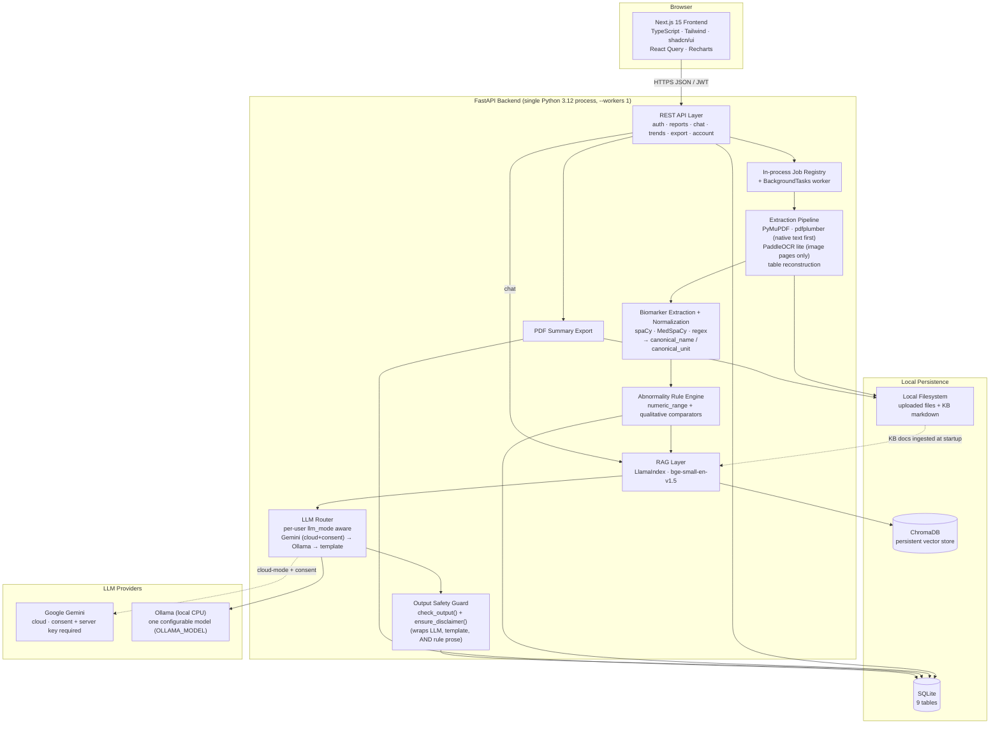
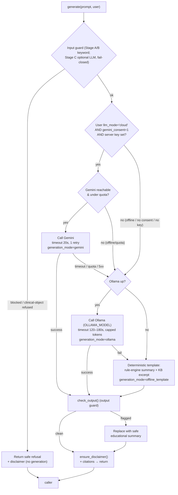
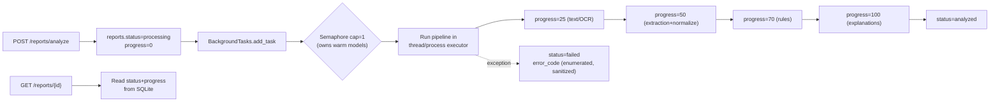

# MedExplain AI — System Architecture

## 1. System Overview

MedExplain AI is a privacy-first, CPU-only educational assistant that helps users understand medical reports they upload as PDF/JPG/PNG. A Next.js 15 frontend talks to a single FastAPI (Python 3.12) backend that orchestrates a deterministic pipeline — native text extraction (PyMuPDF/pdfplumber) with PaddleOCR only on image/scanned pages, table reconstruction, biomarker extraction (spaCy/MedSpaCy + regex) with normalization to canonical names/units, and a rule-based abnormality engine — then layers RAG (LlamaIndex over a ChromaDB persistent store of 9 knowledge-base markdown docs embedded with `bge-small-en-v1.5`) and a per-user-aware LLM router (Google Gemini primary, Ollama fallback, deterministic template floor) to produce plain-language explanations. All persistent state lives in SQLite and the local filesystem; every user-facing explanatory string — LLM output, offline-template assembly, and rule-engine prose — passes through a non-negotiable output safety guard (`check_output()` + `ensure_disclaimer()`) that refuses diagnosis/prescription/dosage content and guarantees the mandatory disclaimer "Consult a licensed healthcare professional for medical advice." before persistence. The whole system ships as a Docker Compose stack designed to run on a single developer's laptop with no GPU, no mandatory paid APIs, and no enterprise infrastructure.

A user's `llm_mode` is authoritative over any global default. In `offline` mode (the privacy-first default) the system makes no network egress — it uses Ollama only, then the deterministic template. In `cloud` mode (allowed only when the user has set `gemini_consent=1` and a server Gemini key is configured) the router tries Gemini first and falls back to Ollama, then to the template.

## 2. Component Diagram



## 3. End-to-End Data Flow: Upload → Analyze → Explain

Analysis performs **exactly one structured LLM generation call per report** (not one per biomarker). The router assembles all abnormal biomarkers — with their statuses, severities, and the KB context retrieved per abnormal marker — into a single prompt, gets back one structured object (`overall_summary`, `per_marker[]`, `doctor_questions[]`), then persists the overall summary to `summaries`, the per-marker explanation + citations onto each `abnormal_findings` row, and the questions to `doctor_questions`. Normal biomarkers get a short deterministic templated note (no LLM). All persisted prose passes the output guard first.

```mermaid
sequenceDiagram
    autonumber
    actor U as User (Browser)
    participant FE as Next.js Frontend
    participant API as FastAPI
    participant JOB as Job Registry / BackgroundTask
    participant PIPE as Extraction Pipeline
    participant NLP as Biomarker Extractor + Normalizer
    participant RULE as Rule Engine
    participant RAG as LlamaIndex + ChromaDB
    participant LLM as LLM Router
    participant SAFE as Output Safety Guard
    participant DB as SQLite
    participant FS as Filesystem

    U->>FE: Select one file, click Upload
    FE->>API: POST /reports/upload (one PDF/JPG/PNG ≤20MB, multipart, JWT)
    API->>FS: Save raw file
    API->>DB: INSERT reports(status=uploaded, progress=0), one report_files row
    API-->>FE: 201 {report_id}

    U->>FE: Click Analyze
    FE->>API: POST /reports/analyze {report_id}
    API->>DB: INSERT job(status=queued); reports.status=processing, progress=0
    API->>JOB: enqueue analyze(report_id) via BackgroundTasks (semaphore cap=1)
    API-->>FE: 202 {job_id, status=processing}

    loop Poll until done
        FE->>API: GET /reports/{id} (status)
        API->>DB: SELECT reports.status, progress
        API-->>FE: {status, progress%}
    end

    Note over JOB,FS: Background work begins (warm-loaded models, single semaphore)
    JOB->>PIPE: run(report_id)
    PIPE->>FS: Load file
    PIPE->>PIPE: Extract embedded text (PyMuPDF/pdfplumber) per page
    PIPE->>PIPE: For pages with NO text layer only → PaddleOCR lite (deskew/denoise/binarize first)
    PIPE->>PIPE: Table reconstruction → structured JSON
    PIPE->>DB: reports.progress=25 (OCR/text-extraction done)
    PIPE->>NLP: structured JSON
    NLP->>NLP: spaCy/MedSpaCy + regex → {test, value, value_text, unit, ref_range}
    NLP->>NLP: Normalize → canonical_name, canonical_unit (synonym/unit dictionary)
    NLP->>DB: INSERT biomarkers (raw test_name/unit + canonical_name/canonical_unit)
    NLP->>DB: reports.progress=50 (extraction done)
    NLP->>RULE: biomarker rows
    RULE->>RULE: numeric_range (value vs ref_low/high) + qualitative (value_text vs expected set) → status, severity, direction
    RULE->>DB: INSERT abnormal_findings (direction ∈ low|high|normal)
    RULE->>SAFE: normal-marker templated notes + any rule-engine prose
    SAFE->>DB: persist guarded normal-marker notes
    RULE->>DB: reports.progress=70 (rules done)

    Note over RULE,RAG: Retrieve KB context per ABNORMAL biomarker (no LLM yet)
    loop For each abnormal biomarker
        RULE->>RAG: query(canonical_name + value + status/severity)
        RAG->>RAG: embed query (bge-small-en-v1.5)
        RAG->>RAG: metadata filter on canonical_name (incl. aliases) → top-k chunks
        RAG-->>LLM: per-marker KB context [{n, doc_title, section, source_path}]
    end

    Note over LLM,SAFE: EXACTLY ONE structured generation call for the whole report
    LLM->>LLM: Assemble single prompt: all abnormal markers + statuses/severities + per-marker KB context
    LLM->>LLM: Route by per-user llm_mode: cloud+consent → Gemini→Ollama→template; offline → Ollama→template
    LLM->>SAFE: structured output {overall_summary, per_marker[], doctor_questions[]}
    SAFE->>SAFE: check_output() on every string + ensure_disclaimer()
    SAFE->>DB: INSERT summaries (overall_summary, generation_mode, model_used)
    SAFE->>DB: UPDATE abnormal_findings.explanation + citations_json per marker
    SAFE->>DB: INSERT doctor_questions

    JOB->>DB: job.status=done; reports.status=analyzed, progress=100
    FE->>API: GET /reports/{id}
    API->>DB: SELECT biomarkers, abnormal_findings (explanation+citations_json), latest summaries, doctor_questions
    API-->>FE: Full report payload (top-level disclaimer field)
    FE-->>U: Render report viewer
```

## 4. LLM Routing Strategy

The router is a thin synchronous component invoked by the analysis pipeline (once per report) and the chat endpoint (once per user message). It encapsulates **per-user mode resolution**, provider selection, timeouts, retries, and degradation so the rest of the system only sees `generate(prompt) -> {structured_output, provider, generation_mode}`.

### Mode resolution (authoritative per-user)

Each user has an `llm_mode` of `cloud` or `offline` (privacy-first default `offline`). The per-user `llm_mode` is **authoritative** over any global config default; the global config only decides whether Gemini is available at all (server key present). Gemini is attempted **only** when all of the following hold: the user's `llm_mode='cloud'`, the user's `gemini_consent=1`, and a server Gemini key is configured. Otherwise the router never contacts Gemini and stays fully local (`offline` mode performs no network egress).

### Selection logic



The output guard (`check_output()` + `ensure_disclaimer()`) is applied on **every** path that produces user-facing prose — Gemini, Ollama, and the deterministic template — and is the authoritative safety layer (see §7 and `07-safety-and-compliance.md`).

### Parameters and behavior

| Concern | Gemini (primary, cloud-mode only) | Ollama (fallback / offline-mode primary) |
|---|---|---|
| Trigger | User `llm_mode='cloud'` AND `gemini_consent=1` AND server key configured AND under daily quota | User `llm_mode='offline'`, OR Gemini ineligible/unreachable/timeout/429/5xx |
| Timeout | 20s | 120–180s (CPU inference is slow); output tokens capped |
| Retries | 1 retry with 2s backoff, then fall through to Ollama | 1 retry, then fall through to template degradation |
| Model | Gemini free-tier model | ONE configurable model via `OLLAMA_MODEL` (e.g. `qwen2.5:3b`); setup pulls this single model — not a runtime multi-model chain |
| `generation_mode` recorded | `gemini` | `ollama` (or `offline_template` if it degrades) |
| Quota guard | Local token-bucket counter (single process) tracks daily request count; pre-empts calls likely to 429 | n/a (local) |

### Graceful degradation (deterministic template floor)

If Gemini is ineligible/unavailable and Ollama is also unavailable (or in `offline` mode with no Ollama), the system never errors out the user flow. It returns a deterministic, template-based summary built from the rule-engine output and the retrieved KB chunk text (e.g., "Hemoglobin is below the reference range (Mild). [KB excerpt on hemoglobin].") with the disclaimer appended. These rows are stored with `summaries.generation_mode='offline_template'`, and the UI badges the offline path off `generation_mode='offline_template'` (not a fragile string match on the free-text `model_used` provenance field). The offline-template assembly **also** runs through `check_output()` before persistence.

### Where the safety guard sits

The output guard is the load-bearing safety layer and wraps every generation path:

1. **Input guard (best-effort)** — English-keyword Stage A/B blocklist (diagnosis requests, "what disease do I have", prescription/medication names with "should I take", dosage queries "how many mg"), plus an optional LLM Stage C that **fails closed** (refuses) on any clinical-object match when the LLM is unavailable — it never fails open on clinical objects. On a block, the router returns a canned safe refusal and never contacts a provider.
2. **Output guard (`check_output()`, authoritative)** — scans every generated/templated/rule-engine string for prohibited content (diagnostic verdicts, treatment/drug recommendations, dosage figures). If flagged, the output is discarded and replaced by a neutral educational summary. This runs on the Gemini path, the Ollama path, AND the deterministic offline-template path.
3. **Mandatory disclaimer (`ensure_disclaimer()`)** — regardless of path (Gemini, Ollama, refusal, template), the final string is guaranteed to contain "Consult a licensed healthcare professional for medical advice." Injection is idempotent (added only if not already present). Every API response carrying explanatory content also includes a top-level `disclaimer` field.

## 5. RAG Design

### Knowledge base and chunking

The 9 KB markdown docs (Hemoglobin, RBC, WBC, Platelets, Cholesterol, Glucose, Vitamin D, Iron, Thyroid markers) live in `/kb/*.md` on the filesystem. Each doc is authored with stable `##` section headings (e.g., *What it measures*, *Why it may be high*, *Why it may be low*, *Lifestyle factors*, *Questions for your doctor*). Chunking is heading-aware via LlamaIndex's `MarkdownNodeParser`, falling back to ~512-token sentence-window splits with ~64-token overlap for any oversized section. Each chunk carries metadata: `{canonical_name, doc_title, section, source_path}`. KB docs are linted for hedged/unsafe language as part of the safety test suite (see `07-safety-and-compliance.md`).

### Embedding and storage

| Step | Choice |
|---|---|
| Embedding model | `BAAI/bge-small-en-v1.5` (384-dim, CPU-friendly, ~130MB) run locally via LlamaIndex `HuggingFaceEmbedding`, warm-loaded once at startup |
| Vector store | ChromaDB local persistent collection `medexplain_kb` |
| Ingestion | One-time at container startup; an idempotent indexer checks a content hash and only re-embeds changed/new docs |
| Index size | Small (tens to low hundreds of chunks) — fits entirely in memory, sub-second retrieval |

### Per-marker retrieval (filtered on canonical_name)

For each abnormal biomarker, the RAG layer builds a query string from the biomarker's `canonical_name`, its measured value, and its computed status/severity (e.g., `"hemoglobin 9.1 g/dL low mild anemia education"`). It uses a **metadata filter on `canonical_name` (including known aliases)** so retrieval is scoped to the right doc first, then ranks by vector similarity (top-k = 3 chunks). Filtering on the normalized `canonical_name` rather than the raw printed `test_name` keeps explanations on-topic across synonym spellings (e.g. Hb/HGB/Hgb all map to `hemoglobin`) and prevents, e.g., the Glucose doc bleeding into a Hemoglobin explanation. The per-marker KB contexts are collected first and then handed to the **single** report-level generation call (see §3).

### Prompt assembly (report context + KB context, single structured call)

```
SYSTEM: You are an educational assistant. You DO NOT diagnose, prescribe,
        or give dosage advice. Explain in plain language. Return STRUCTURED
        output. Always include the disclaimer.

REPORT CONTEXT (structured, from this user's report — ALL abnormal markers):
  For each abnormal biomarker:
    - canonical_name: {canonical_name}   (display: {test_name})
    - Value: {value} {unit}   (canonical_unit: {canonical_unit})
    - Reference range: {ref_low}-{ref_high}
    - Status: {status} / Severity: {severity} / Direction: {direction}

KNOWLEDGE BASE CONTEXT (retrieved per marker, cite by [n]):
  {canonical_name}:
    [1] {chunk_text}  (source: {doc_title} › {section})
    [2] ...

TASK: Produce a single JSON object:
  {
    overall_summary,
    per_marker: [{ test_name, explanation, citations:[{n,doc_title,section,source_path}] }],
    doctor_questions: [{ question_text, category }]
  }
  Explain only from the KB context; reference each marker's specific value.
  End the overall_summary with the mandatory disclaimer.
```

The report context is always the user's own structured data (never embedded into the KB); KB context is the retrieved educational chunks. The two are kept in clearly labeled sections so the model grounds explanations in the KB while referencing the specific values. The structured response is parsed and persisted as: `summaries.overall_summary` (one-latest-per-report), per-marker `abnormal_findings.explanation` + `abnormal_findings.citations_json`, and `doctor_questions` rows. There is no per-explanation table.

### Citation strategy

Each retrieved chunk is numbered `[n]` and mapped to `{doc_title › section}`. The prompt instructs the model to cite claims with `[n]`. Each per-marker entry stores its `citations` JSON array (`[{n, doc_title, section, source_path}]`) into `abnormal_findings.citations_json` so the UI can render "Sources: Hemoglobin › Why it may be low". If the model fails to cite, the system still attaches the retrieved sources as references (retrieval-grounded), so provenance is never lost.

## 6. Concurrency / Runtime Model

### Recommendation: a single-worker process with an in-process job registry

A single FastAPI process pinned to **one Uvicorn worker (`--workers 1`)** handles all requests. For slow extraction/analysis we use **FastAPI `BackgroundTasks` to execute the work, backed by a persistent status tracked through the report's own `status`/`progress` columns + an in-process job registry** rather than relying on `BackgroundTasks` alone.

The single-worker constraint is deliberate and load-bearing: **one in-process semaphore (cap = 1 concurrent analysis) owns the warm-loaded models** (PaddleOCR, spaCy/MedSpaCy, `bge-small-en-v1.5`), and the in-process job registry, rate-limiter/login-attempt guard, and daily quota counter all assume a single process. Running multiple workers would desync these in-memory structures and duplicate the heavy model load, so the process is pinned to one worker.

Rationale and trade-off:

- **Bare `BackgroundTasks`** is the simplest mechanism but is fire-and-forget and in-memory only — if the process restarts mid-analysis, the frontend polling `GET /reports/{id}` would hang forever on `status=processing` with no recovery.
- We keep the simplicity of `BackgroundTasks` (no Celery, no Redis, no external broker — all forbidden/overkill) **but persist status transitions to SQLite** (`reports.status`: `uploaded → processing → analyzed | failed`, plus a `progress` integer 0–100 and a sanitized enumerated `error_code`). On startup, a reconciler marks any `processing` rows older than a threshold as `failed` with `error_code='timeout'` (or retryable), so a crash never leaves a permanently stuck report.
- CPU-bound extraction/OCR is run in a thread/process executor so it does not block the event loop. Concurrency is capped at **1 concurrent analysis** via the semaphore that owns the warm models, because PaddleOCR + local LLM inference are heavy on a laptop and we prefer reliable serialized throughput over contention.
- **Error reporting never leaks PHI.** On failure the pipeline writes a sanitized, enumerated `reports.error_code` (e.g. `ocr_failed`, `extraction_failed`, `llm_unavailable`, `timeout`, `internal_error`) — never raw exception text or report content.



### Progress and status reporting to the frontend

- **Upload progress**: native browser/`XMLHttpRequest` (or fetch with a progress-capable client) reports byte-upload progress for the multipart `POST /reports/upload` (exactly one PDF/JPG/PNG, ≤20MB); the server responds `201 {report_id}` when the file is persisted.
- **Analyze status**: `POST /reports/analyze` returns `202 {report_id, status: "processing"}` immediately. The frontend uses **React Query polling** on `GET /reports/{id}` (e.g., `refetchInterval` ~2s while status is `processing`/`uploaded`, stopping at `analyzed`/`failed`). The pipeline writes coarse `progress` checkpoints (OCR/text-extraction 25 → extraction+normalization 50 → rules 70 → explanations 100) so the UI shows a moving bar without WebSockets/SSE (deliberately omitted to keep the stack simple). On failure the UI reads `reports.error_code` and maps it to a friendly message client-side.

## 7. Key Cross-Cutting Decisions and Trade-offs

- **Deterministic core, LLM only for prose.** Native text extraction → OCR (image pages only) → normalization → rule engine produces all structured biomarkers, statuses, severities, and directions *without* the LLM; the LLM is used solely to phrase educational explanations and doctor questions in **one structured call per report**. This keeps the medically-relevant logic auditable and reproducible, lets the app work (degraded) fully offline, and avoids trusting a model with clinical-adjacent computation — directly serving the CPU-only/free/reliability constraints.
- **Native-text-first extraction with lite OCR fallback.** The pipeline prefers embedded text via PyMuPDF/pdfplumber and runs PaddleOCR (lite/mobile models) **only** on pages with no text layer (scanned images). Text-native PDFs are never OCR'd. All heavy models (OCR, spaCy/MedSpaCy, `bge-small-en-v1.5`) are warm-loaded once at startup so per-report latency excludes cold-start cost.
- **Single worker, single semaphore owns the warm models.** Uvicorn is pinned to `--workers 1`; the in-process job registry, login-attempt guard, daily Gemini quota counter, and the one-concurrent-analysis semaphore all assume a single process. This is the simplest correct design for 1–2 concurrent users on one laptop and avoids the desync a multi-worker setup would introduce.
- **Per-user LLM mode is authoritative (privacy-first).** `offline` is the default and performs no network egress (Ollama → deterministic template). `cloud` mode is opt-in: Gemini is attempted only when `llm_mode='cloud'`, `gemini_consent=1`, and a server key is configured — otherwise the router stays local. Global config only gates whether Gemini is available at all; it never overrides a user's mode.
- **One configurable Ollama model, not a runtime chain.** A single `OLLAMA_MODEL` (env, e.g. `qwen2.5:3b`) is pulled at setup; timeout is 120–180s with capped output tokens. This avoids the cost and complexity of orchestrating multiple local models at runtime.
- **Polling over WebSockets/SSE.** React Query `refetchInterval` against the persisted `status`/`progress` columns is trivially reliable on a single process and needs no extra transport, connection management, or broker.
- **In-process BackgroundTasks + persisted status instead of Celery/Redis.** A real task queue is explicitly forbidden and unjustified for 1–2 concurrent users on one machine. Persisting `status`/`progress`/`error_code` to SQLite recovers the one real weakness of `BackgroundTasks` (crash visibility) at near-zero complexity cost, and the sanitized enumerated `error_code` keeps failures PHI-free.
- **Gemini-primary (consented) with offline Ollama fallback and template degradation.** Using Gemini first (in consented cloud mode) gives the best explanation quality at zero cost; Ollama keeps the app functional with no network; the deterministic template ensures the app *never* hard-fails on LLM unavailability.
- **Single embedding model + small local ChromaDB, retrieval filtered on canonical_name.** `bge-small-en-v1.5` (384-dim) is small enough to run on CPU and produce sub-second retrieval over a tiny 9-doc KB. Metadata filtering on the normalized `canonical_name` (incl. aliases) keeps retrieval on-topic; we deliberately avoid larger embedding models, rerankers, or hybrid search as overengineering.
- **Safety enforced centrally on every prose path, not per-feature.** The output guard (`check_output()` + `ensure_disclaimer()`) wraps the router and is applied to LLM output, the deterministic offline-template assembly, AND rule-engine explanation text before persistence; every API response carrying explanatory content also includes a top-level `disclaimer` field. No user-facing generated/templated/rule-engine prose reaches the user without passing the output guard — making the non-negotiable safety rules structurally enforced. The input guard is English-keyword best-effort whose optional LLM stage fails closed on clinical objects; the output guard is authoritative. (Details in `07-safety-and-compliance.md`.)
- **Deliberately kept simple (anti-overengineering note):** no Kubernetes, no microservices, no message broker, no separate vector-DB service, no GPU, no real-time sockets, no multi-agent orchestration, no multi-file uploads (one file per report in the MVP). One single-worker FastAPI process, one SQLite file, one local ChromaDB directory, one filesystem folder for uploads, and a thin per-user-aware LLM router — the minimum that satisfies all functional requirements and is maintainable by a single developer.

See also: `00-design-review.md`, `02-folder-structure.md`, `03-database-schema.md`, `04-api-spec.md`, `05-ui-wireframes.md`, `06-roadmap.md`, `07-safety-and-compliance.md`, `08-rag-design.md`, `09-review-resolution.md`.
