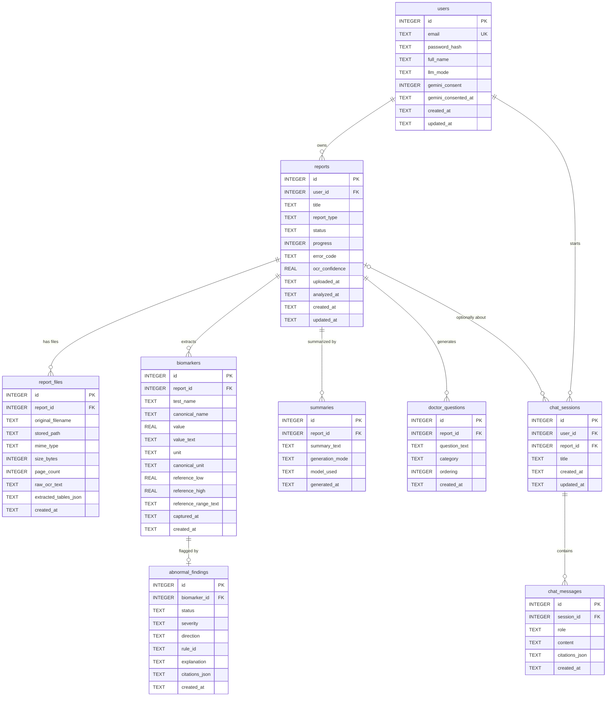

# Database Schema — MedExplain AI

This document defines the complete SQLite data model for MedExplain AI. The design favors simplicity, single-file portability, and low maintenance overhead — appropriate for a local, CPU-only deployment on a developer laptop. All nine required tables are modeled below with explicit relationships, constraints, and indexes.

## Conventions

- **Primary keys**: Every table uses `id INTEGER PRIMARY KEY` (SQLite's auto-incrementing `rowid` alias). This is the fastest, simplest option for SQLite and avoids the storage/index overhead of TEXT UUIDs. Integer FKs keep joins and indexes compact.
- **Timestamps**: All time columns are stored as **TEXT in ISO-8601 UTC** (e.g. `2026-06-09T14:30:00Z`), populated via SQLite's `datetime('now')` default or by the application layer. ISO-8601 text sorts lexicographically in chronological order, which makes trend queries straightforward without epoch conversion. The convention is consistent across every table.
- **Booleans**: Stored as `INTEGER` (0/1) with a `CHECK` constraint where used.
- **Enums**: Enforced with `CHECK (... IN (...))` constraints rather than lookup tables — fewer joins, fewer moving parts, and the allowed sets are small and stable.
- **JSON**: Variable/semi-structured payloads (OCR tables, citations) are stored as `TEXT` containing JSON. SQLite's JSON1 functions (`json_extract`, etc.) are available if needed, but the app primarily serializes/deserializes in Python.
- **Foreign keys**: SQLite does **not** enforce foreign keys by default. The application MUST run `PRAGMA foreign_keys = ON;` on **every connection** (it is a per-connection setting, not persisted). With SQLAlchemy this is wired via a `connect` event listener.
- **Single-writer assumption**: The backend runs as a single Uvicorn worker (`--workers 1`), so there is exactly one process holding open connections to this database. The in-process job registry, rate-limiter, and analysis semaphore all rely on this; the schema's defaults and WAL settings are tuned for one writer rather than a connection pool spread across workers.

> **PRAGMA note:** Execute `PRAGMA foreign_keys = ON;` immediately after opening each connection. Also recommended for a laptop deployment: `PRAGMA journal_mode = WAL;` (better read/write concurrency) and `PRAGMA busy_timeout = 5000;` (avoid spurious "database is locked" errors).

## Entity-Relationship Diagram

A `user` owns many `reports`. Each `report` has one or more `report_files` (the uploaded PDF/image plus its OCR output — for the MVP exactly one file is created per report), many extracted `biomarkers`, one latest `summary` (regenerable), and many `doctor_questions`. Each `biomarker` may have one `abnormal_finding` produced by the rule engine. `chat_sessions` belong to a `user` and optionally to a `report` (general chat vs. chat-with-report), and contain many `chat_messages`. Each `user` also carries an `llm_mode` (privacy-first default `offline`) plus the Gemini consent flag/timestamp that govern whether cloud generation is permitted.



## Table Definitions

The statements below are ordered to satisfy FK dependencies (parents before children) and can be run as a single migration script.

### users

The account table. `email` is the unique login identity; passwords are stored only as hashes (bcrypt/argon2 — never plaintext). Three columns govern LLM generation policy for this account:

- `llm_mode` — `'offline'` (the privacy-first default) means Ollama-only generation falling back to a deterministic template, with **no network egress**; `'cloud'` means Gemini is the primary generator with Ollama as fallback. **The per-user `llm_mode` is authoritative** over any global config default — the global config only decides whether Gemini is *available at all* (i.e. whether a server Gemini key is configured). `'cloud'` is honored only when `gemini_consent = 1` **and** a server Gemini key is configured; otherwise generation behaves as offline.
- `gemini_consent` — `0/1` flag. Switching to `'cloud'` on the Profile page sets this to `1` and stamps `gemini_consented_at`.
- `gemini_consented_at` — ISO-8601 timestamp of the moment cloud consent was granted (NULL until consent is given).

These columns back the account/Profile endpoints (`GET /auth/me`, `PATCH /users/me`, `PATCH /users/me/settings`, `POST /auth/change-password`, `DELETE /users/me`) defined in `04-api-spec.md`. Deleting a user (`DELETE /users/me`) cascades all child rows via the FK `ON DELETE CASCADE` chains below, and the application additionally removes the user's files on disk and their vector-store entries.

```sql
CREATE TABLE users (
    id                  INTEGER PRIMARY KEY,
    email               TEXT NOT NULL UNIQUE
                            CHECK (length(email) <= 320 AND email LIKE '%_@_%.__%'),
    password_hash       TEXT NOT NULL,
    full_name           TEXT,
    llm_mode            TEXT NOT NULL DEFAULT 'offline'
                            CHECK (llm_mode IN ('cloud', 'offline')),
    gemini_consent      INTEGER NOT NULL DEFAULT 0
                            CHECK (gemini_consent IN (0, 1)),
    gemini_consented_at TEXT,
    created_at          TEXT NOT NULL DEFAULT (strftime('%Y-%m-%dT%H:%M:%SZ', 'now')),
    updated_at          TEXT NOT NULL DEFAULT (strftime('%Y-%m-%dT%H:%M:%SZ', 'now'))
);
```

### reports

One row per uploaded medical report. `report_type` and `status` are constrained enums. `progress` is an integer 0–100 that drives the analysis progress UI; `error_code` is a sanitized, enumerated failure code (never raw exception text). `ocr_confidence` is a 0–1 mean confidence reported by PaddleOCR (nullable until OCR runs).

- **`status`** transitions through `uploaded → processing → analyzed`, or `→ failed` on error. The value `processing` is used everywhere; there is no `analyzing` value.
- **`progress`** advances at fixed pipeline checkpoints: OCR `25`, extraction `50`, rules `70`, explanations `100`. It defaults to `0` at upload.
- **`error_code`** is NULL unless `status = 'failed'`. It holds a **sanitized, enumerated** code drawn from a fixed allowed set — e.g. `'ocr_failed'`, `'extraction_failed'`, `'llm_unavailable'`, `'timeout'`, `'internal_error'`. Raw exception messages or any text that could carry PHI are **never** stored here or returned to clients.
- **`report_type`** enum is unchanged. Note that `'cbc'` is a specific blood panel (complete blood count) while `'blood'` is a generic blood report; the extractor picks the **most specific** type it can identify.

```sql
CREATE TABLE reports (
    id             INTEGER PRIMARY KEY,
    user_id        INTEGER NOT NULL,
    title          TEXT NOT NULL DEFAULT 'Untitled report',
    report_type    TEXT NOT NULL DEFAULT 'other'
                       CHECK (report_type IN (
                           'blood', 'cbc', 'mri', 'ct', 'xray',
                           'pathology', 'prescription', 'discharge', 'other'
                       )),
    status         TEXT NOT NULL DEFAULT 'uploaded'
                       CHECK (status IN ('uploaded', 'processing', 'analyzed', 'failed')),
    progress       INTEGER NOT NULL DEFAULT 0
                       CHECK (progress BETWEEN 0 AND 100),
    error_code     TEXT
                       CHECK (error_code IS NULL OR error_code IN (
                           'ocr_failed', 'extraction_failed', 'llm_unavailable',
                           'timeout', 'internal_error'
                       )),
    ocr_confidence REAL CHECK (ocr_confidence IS NULL OR (ocr_confidence >= 0 AND ocr_confidence <= 1)),
    uploaded_at    TEXT NOT NULL DEFAULT (strftime('%Y-%m-%dT%H:%M:%SZ', 'now')),
    analyzed_at    TEXT,
    created_at     TEXT NOT NULL DEFAULT (strftime('%Y-%m-%dT%H:%M:%SZ', 'now')),
    updated_at     TEXT NOT NULL DEFAULT (strftime('%Y-%m-%dT%H:%M:%SZ', 'now')),
    FOREIGN KEY (user_id) REFERENCES users(id) ON DELETE CASCADE
);
```

> Note: the schema uses `status` value `processing` (matching the FastAPI endpoint flow `uploaded → processing → analyzed/failed`). The brief's `analyzing` is normalized to `processing` everywhere. `error_code` is a sanitized enumerated code by design — see `07-safety-and-compliance.md` for the no-PHI-in-errors rule.

### report_files

The physical uploaded artifacts and their OCR output. `stored_path` points at a file on local disk; binary blobs are **not** stored in SQLite. `raw_ocr_text` and `extracted_tables_json` hold the OCR/parsing output.

For the **MVP, exactly one file is uploaded per report** (`POST /reports/upload` accepts exactly one PDF/JPG/PNG, ≤ 20 MB), so the MVP creates a single `report_files` row per report. The table is modeled one-report-to-many-files so a future enhancement (e.g. a multi-page scan split across several images) can add additional rows without a schema change, but no multi-file upload path exists in the MVP.

Extraction prefers the embedded text layer (PyMuPDF/pdfplumber); PaddleOCR (lite/mobile models) runs **only** on pages that have no text layer (scanned images). So `raw_ocr_text` may be empty for fully text-native PDFs, where `extracted_tables_json` is populated from the parsed text/tables rather than from OCR.

```sql
CREATE TABLE report_files (
    id                    INTEGER PRIMARY KEY,
    report_id             INTEGER NOT NULL,
    original_filename     TEXT NOT NULL,
    stored_path           TEXT NOT NULL UNIQUE,
    mime_type             TEXT NOT NULL
                              CHECK (mime_type IN (
                                  'application/pdf', 'image/jpeg', 'image/png'
                              )),
    size_bytes            INTEGER NOT NULL CHECK (size_bytes >= 0),
    page_count            INTEGER CHECK (page_count IS NULL OR page_count >= 0),
    raw_ocr_text          TEXT,
    extracted_tables_json TEXT,   -- JSON array of tables (pdfplumber/PaddleOCR output)
    created_at            TEXT NOT NULL DEFAULT (strftime('%Y-%m-%dT%H:%M:%SZ', 'now')),
    FOREIGN KEY (report_id) REFERENCES reports(id) ON DELETE CASCADE
);
```

### biomarkers

Structured test results extracted by the NLP/table pipeline (spaCy + MedSpaCy + table parsing). Numeric results live in `value`; non-numeric or qualitative results (e.g., "Positive", "Trace") live in `value_text`. Reference bounds are split into machine-comparable `reference_low`/`reference_high` plus the original human-readable `reference_range_text` for display and audit.

`test_name` and `unit` preserve the **raw printed values** for display. `canonical_name` and `canonical_unit` hold **normalized keys** used for grouping, trends, and knowledge-base retrieval. A synonym dictionary file maps printed names/units to their canonical forms (with unit-conversion factors where needed) — for example `{Hb, HGB, Hgb, Hemoglobin} → hemoglobin` and `{10^3/uL, K/uL} → 10^3/uL`. Trend queries group/filter on `canonical_name`, and KB retrieval filters on `canonical_name` (including its aliases). `canonical_name`/`canonical_unit` are nullable for results the dictionary can't normalize (those still display via the raw `test_name`/`unit`).

```sql
CREATE TABLE biomarkers (
    id                   INTEGER PRIMARY KEY,
    report_id            INTEGER NOT NULL,
    test_name            TEXT NOT NULL,            -- raw printed name, e.g. 'Hb' or 'Hemoglobin'
    canonical_name       TEXT,                     -- normalized key, e.g. 'hemoglobin' (NULL if unmapped)
    value                REAL,                     -- numeric result (NULL if qualitative)
    value_text           TEXT,                     -- raw/qualitative result, e.g. 'Positive'
    unit                 TEXT,                     -- raw printed unit, e.g. 'g/dL'
    canonical_unit       TEXT,                     -- normalized unit, e.g. 'g/dL' (NULL if unmapped)
    reference_low        REAL,
    reference_high       REAL,
    reference_range_text TEXT,                     -- original printed range, e.g. '13.0-17.0'
    captured_at          TEXT,                     -- specimen/collection date if on report (ISO-8601)
    created_at           TEXT NOT NULL DEFAULT (strftime('%Y-%m-%dT%H:%M:%SZ', 'now')),
    CHECK (value IS NOT NULL OR value_text IS NOT NULL),
    CHECK (reference_low IS NULL OR reference_high IS NULL OR reference_low <= reference_high),
    FOREIGN KEY (report_id) REFERENCES reports(id) ON DELETE CASCADE
);
```

### abnormal_findings

Output of the deterministic rule engine, one row per evaluated biomarker. `status` distinguishes normal vs. abnormal; `severity` grades the result; `direction` records which side of the range the value fell on. `rule_id` links back to the rule that fired (for traceability).

The rule engine supports two rule types:

- **`numeric_range`** — compares `value` against `reference_low`/`reference_high`. `direction` is `'low'` or `'high'`; severity is derived from how far outside the range the value sits.
- **`qualitative`** — compares `value_text` against an expected set configured per test. `status` follows the expected/unexpected match, and **severity is rule-defined** (configured per test; default `'mild'` when the result is unexpected) rather than computed from magnitude. For a genuinely qualitative test such as Urine Protein, expected `Negative → Positive` yields status `abnormal`, severity `mild`. (Glucose, by contrast, is a numeric test and is handled by a `numeric_range` rule.)

`direction` is restricted to `'low'`, `'high'`, or `'normal'` only. The UI renders a down-arrow for `low` and an up-arrow for `high`; the word "Elevated" is display-only phrasing for some high results and is **never** a stored value.

`explanation` holds the per-biomarker plain-language explanation, and `citations_json` holds the supporting KB citations for that explanation as a JSON array (see *Storing OCR Text, Tables, and Citations* below). For abnormal biomarkers these are produced by the single structured LLM generation call per report (see `08-rag-design.md`); for normal biomarkers `explanation` is a short deterministic templated note and `citations_json` is typically empty/NULL. Both the LLM and the offline/template paths route this text through `check_output()` + `ensure_disclaimer()` before it is persisted (see `07-safety-and-compliance.md`). The Report Viewer reads the per-finding explanation from `abnormal_findings.explanation` + `citations_json`; the overall summary is read from the latest `summaries` row.

```sql
CREATE TABLE abnormal_findings (
    id            INTEGER PRIMARY KEY,
    biomarker_id  INTEGER NOT NULL UNIQUE,         -- one finding per biomarker
    status        TEXT NOT NULL
                      CHECK (status IN ('normal', 'abnormal')),
    severity      TEXT NOT NULL
                      CHECK (severity IN ('normal', 'mild', 'moderate', 'severe')),
    direction     TEXT NOT NULL DEFAULT 'normal'
                      CHECK (direction IN ('low', 'high', 'normal')),
    rule_id       TEXT,                            -- e.g. 'HGB_LOW_ADULT_M'
    explanation   TEXT,                            -- per-biomarker plain-language note (guarded before persist)
    citations_json TEXT,                           -- JSON array of KB citations backing the explanation
    created_at    TEXT NOT NULL DEFAULT (strftime('%Y-%m-%dT%H:%M:%SZ', 'now')),
    CHECK (
        (status = 'normal'   AND severity = 'normal' AND direction = 'normal') OR
        (status = 'abnormal' AND severity IN ('mild', 'moderate', 'severe'))
    ),
    FOREIGN KEY (biomarker_id) REFERENCES biomarkers(id) ON DELETE CASCADE
);
```

### summaries

The plain-language **overall** report summary generated by the RAG/LLM layer. Multiple rows are permitted (regeneration history / different models), with `generated_at` distinguishing them; the app reads the **most recent** row per report. `generation_mode` records *how* the summary was produced and is the authoritative signal for UI badging (e.g. the "offline" badge keys off `generation_mode = 'offline_template'`, not a fragile string match on `model_used`). `model_used` remains free-text provenance (e.g. `gemini-2.5-flash`, `ollama/qwen2.5:3b`, or `offline-template-v1`).

The overall summary is produced by the **single structured LLM generation call per report** (the same call that returns per-marker explanations and doctor questions — see D-ONECALL in `08-rag-design.md`); in `offline` mode with Ollama unavailable it is assembled deterministically. Every stored summary has already passed `check_output()` + `ensure_disclaimer()` at generation time, so the mandatory safety disclaimer is embedded in `summary_text`.

```sql
CREATE TABLE summaries (
    id              INTEGER PRIMARY KEY,
    report_id       INTEGER NOT NULL,
    summary_text    TEXT NOT NULL,
    generation_mode TEXT NOT NULL DEFAULT 'offline_template'
                        CHECK (generation_mode IN ('gemini', 'ollama', 'offline_template')),
    model_used      TEXT NOT NULL,                 -- free-text provenance of the generating model
    generated_at    TEXT NOT NULL DEFAULT (strftime('%Y-%m-%dT%H:%M:%SZ', 'now')),
    FOREIGN KEY (report_id) REFERENCES reports(id) ON DELETE CASCADE
);
```

### doctor_questions

Suggested questions for the user to ask their physician, generated per report. `category` groups them; `ordering` controls display sequence. These come from the same single structured generation call as the summary and per-marker explanations.

```sql
CREATE TABLE doctor_questions (
    id            INTEGER PRIMARY KEY,
    report_id     INTEGER NOT NULL,
    question_text TEXT NOT NULL,
    category      TEXT NOT NULL DEFAULT 'follow-up'
                      CHECK (category IN ('cause', 'follow-up', 'clarification')),
    ordering      INTEGER NOT NULL DEFAULT 0,
    created_at    TEXT NOT NULL DEFAULT (strftime('%Y-%m-%dT%H:%M:%SZ', 'now')),
    FOREIGN KEY (report_id) REFERENCES reports(id) ON DELETE CASCADE
);
```

### chat_sessions

A conversation thread. Always belongs to a `user`. `report_id` is **nullable**: when set, it's chat-with-report (RAG scoped to that report); when NULL, it's a general educational chat. Note the FK uses `ON DELETE SET NULL` so deleting a report converts its chats to general chats rather than destroying conversation history.

```sql
CREATE TABLE chat_sessions (
    id         INTEGER PRIMARY KEY,
    user_id    INTEGER NOT NULL,
    report_id  INTEGER,                           -- nullable: NULL = general chat
    title      TEXT NOT NULL DEFAULT 'New chat',
    created_at TEXT NOT NULL DEFAULT (strftime('%Y-%m-%dT%H:%M:%SZ', 'now')),
    updated_at TEXT NOT NULL DEFAULT (strftime('%Y-%m-%dT%H:%M:%SZ', 'now')),
    FOREIGN KEY (user_id)   REFERENCES users(id)   ON DELETE CASCADE,
    FOREIGN KEY (report_id) REFERENCES reports(id) ON DELETE SET NULL
);
```

### chat_messages

Individual turns in a session. `role` is `user` or `assistant`. `citations_json` stores the RAG source references (knowledge-base doc IDs / chunk spans) backing an assistant answer, as a JSON array. Each chat response is produced by its own single LLM call per user message, and every assistant turn's `content` passes through `check_output()` + `ensure_disclaimer()` before it is persisted.

```sql
CREATE TABLE chat_messages (
    id            INTEGER PRIMARY KEY,
    session_id    INTEGER NOT NULL,
    role          TEXT NOT NULL CHECK (role IN ('user', 'assistant')),
    content       TEXT NOT NULL,
    citations_json TEXT,                           -- JSON array of RAG citations (assistant turns)
    created_at    TEXT NOT NULL DEFAULT (strftime('%Y-%m-%dT%H:%M:%SZ', 'now')),
    FOREIGN KEY (session_id) REFERENCES chat_sessions(id) ON DELETE CASCADE
);
```

## Indexes

Indexes cover every foreign key (SQLite does not auto-index FKs) plus the hot query paths: listing a user's reports, fetching a report's children, and the cross-report biomarker trend lookup.

```sql
-- Foreign-key / ownership lookups
CREATE INDEX idx_reports_user_id            ON reports(user_id);
CREATE INDEX idx_report_files_report_id     ON report_files(report_id);
CREATE INDEX idx_biomarkers_report_id       ON biomarkers(report_id);
CREATE INDEX idx_abnormal_findings_biomarker_id ON abnormal_findings(biomarker_id);
CREATE INDEX idx_summaries_report_id        ON summaries(report_id);
CREATE INDEX idx_doctor_questions_report_id ON doctor_questions(report_id);
CREATE INDEX idx_chat_sessions_user_id      ON chat_sessions(user_id);
CREATE INDEX idx_chat_sessions_report_id    ON chat_sessions(report_id);
CREATE INDEX idx_chat_messages_session_id   ON chat_messages(session_id);

-- Trend analysis: a given biomarker across all of a user's reports, ordered by time.
-- canonical_name leads so the equality predicate is index-resolved; report_id supports the join.
CREATE INDEX idx_biomarkers_canonical_report ON biomarkers(canonical_name, report_id);

-- Common dashboard sorts
CREATE INDEX idx_reports_user_uploaded      ON reports(user_id, uploaded_at);
CREATE INDEX idx_doctor_questions_report_order ON doctor_questions(report_id, ordering);
CREATE INDEX idx_chat_messages_session_created ON chat_messages(session_id, created_at);

-- Latest summary per report
CREATE INDEX idx_summaries_report_generated ON summaries(report_id, generated_at);
```

## Trend Query (drives `GET /trends`)

Trend analysis tracks one biomarker (e.g. Hemoglobin) for one user across all of their reports over time. The endpoint's query parameter is **`biomarker`** — a `canonical_name` string (e.g. `hemoglobin`), **not** a raw `test_name` — so that synonyms printed differently across labs (`Hb`, `HGB`, `Hemoglobin`) collapse onto the same series. Because biomarkers are linked to reports and reports to users, the query joins the two and orders by the biomarker's `captured_at` (falling back to the report's `uploaded_at` when the lab didn't print a collection date):

```sql
SELECT
    r.id                                   AS report_id,
    COALESCE(b.captured_at, r.uploaded_at) AS point_time,
    b.value,
    b.unit,
    b.canonical_unit,
    b.reference_low,
    b.reference_high,
    f.severity,
    f.direction
FROM biomarkers b
JOIN reports r            ON r.id = b.report_id
LEFT JOIN abnormal_findings f ON f.biomarker_id = b.id
WHERE r.user_id = :user_id
  AND b.canonical_name = :biomarker   -- e.g. 'hemoglobin'
  AND b.value IS NOT NULL             -- numeric points only, for the line chart
ORDER BY point_time ASC;
```

This returns a time-ordered series ready for Recharts on the Trend Dashboard, including each point's reference band and abnormality flag for shading/markers. The `idx_biomarkers_canonical_report` index resolves the `canonical_name` equality, and `idx_reports_user_id` resolves the user filter on the join. To enumerate which biomarkers a user actually has trendable history for (≥ 2 numeric points), the biomarker selector lists the distinct `canonical_name` values with at least two numeric points — the same join aggregated with `GROUP BY b.canonical_name HAVING COUNT(*) >= 2`.

## Storing OCR Text, Tables, and Citations

Four columns hold semi-structured payloads as `TEXT`:

| Column | Table | Contents | Shape |
| --- | --- | --- | --- |
| `raw_ocr_text` | `report_files` | Full concatenated OCR text from PaddleOCR (empty for text-native PDFs read via PyMuPDF/pdfplumber) | Plain text |
| `extracted_tables_json` | `report_files` | Detected tables from pdfplumber/PaddleOCR | JSON array of `{ "page": int, "rows": [[cell, ...], ...] }` |
| `citations_json` | `abnormal_findings` | KB sources backing a per-marker explanation | JSON array of `{ "n": int, "doc_title": "...", "section": "...", "source_path": "..." }` |
| `citations_json` | `chat_messages` | RAG sources backing an assistant turn | JSON array of `{ "doc": "Hemoglobin", "chunk_id": "...", "score": float }` |

**Why TEXT/JSON columns are the right choice here:**

- **No fixed schema.** OCR table layouts and citation lists vary wildly between reports and answers. Forcing them into rigid relational tables would mean brittle, sparse, over-normalized structures for data that is only ever read back as a whole blob alongside its parent row.
- **Read/write access pattern is whole-object.** The app always loads a file's OCR text, a finding's citations, or a message's citations together with the row itself and deserializes in Python. There is no need to query *inside* these blobs relationally, so normalization buys nothing.
- **SQLite handles it natively and cheaply.** `TEXT` has no length limit, and the JSON1 extension (`json_extract`, `json_array_length`) is bundled with SQLite if ad-hoc inspection is ever needed — so this choice forecloses nothing.
- **Simplicity and single-developer maintenance.** Fewer tables, fewer migrations, fewer joins. Storing per-marker citations as `citations_json` on `abnormal_findings` (rather than a new table) keeps the entire data model to the nine required tables while still capturing rich pipeline output — exactly the right trade-off for a CPU-only, single-file, laptop-local deployment.

Binary artifacts (the original PDF/JPG/PNG) are deliberately **never** stored in the database — only their `stored_path` on disk is recorded in `report_files`. This keeps the SQLite file small, fast to back up (a single copy of one `.db` file), and quick to open.
