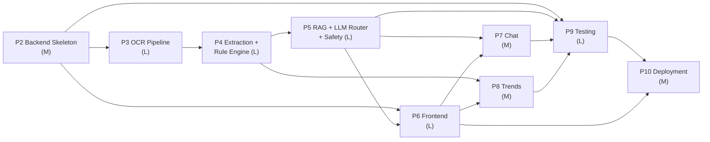

# MedExplain AI — Development Roadmap (Phases 2–10)

> **Document scope.** Phase 1 (design) is complete: Architecture (`docs/01-architecture.md`), Folder Structure (`docs/02-folder-structure.md`), Database Schema (`docs/03-database-schema.md`), API Spec (`docs/04-api-spec.md`), UI Wireframes (`docs/05-ui-wireframes.md`), this Roadmap (`docs/06-roadmap.md`), Safety & Compliance (`docs/07-safety-and-compliance.md` — controlling), RAG Design (`docs/08-rag-design.md`), and the Design Review / Review Resolution (`docs/00-design-review.md`, `docs/09-review-resolution.md`). This document sequences the **build**: nine implementation phases (P2–P10), each with a goal, task checklist, files touched, prerequisites, definition-of-done, and risks/mitigations. Estimates are **relative size (S/M/L)**, never calendar dates. The build optimizes for a single developer, CPU-only laptop, free/OSS tooling, simplicity, and reliability. **The Safety doc wins any conflict.**

---

## 0. How to Read This Roadmap

| Convention | Meaning |
|---|---|
| **Size** | S = small/contained · M = moderate, multi-file · L = large/heavy or research-y |
| **DoD** | Definition of Done — the checklist gate that lets the phase be called complete |
| **Touches** | Key files/modules from the folder-structure doc that the phase creates or modifies |
| **Vertical-slice rule** | Each phase should end in something runnable/demoable, not a half-wired layer |
| **Safety-first rule** | No user-facing generated text ships before P5's safety guard exists; until then, surfaces show structured/deterministic data only |

### Dependency graph (phase level)

**Critical path:** P2 → P3 → P4 → P5 → (P6/P7/P8) → P9 → P10. The frontend (P6) can begin against P2's stubbed/mocked endpoints in parallel once the API shapes are frozen, but its content-bearing screens (Report Viewer explanations, Chat) only become real after P5.

---

## Phase 2 — Backend Skeleton

**Size: M**

### Goal
Stand up the FastAPI application factory, configuration, SQLite initialization (the canonical 9-table DDL), per-connection PRAGMA wiring, JWT auth, the full account/settings surface, Pydantic v2 schemas, the global error envelope, and the empty router surface for every required endpoint — so that the API contract is live (even if downstream handlers return `501`/stubs) and the frontend can integrate against it. The DDL here already carries every reconciled column: `users.llm_mode`/`gemini_consent`/`gemini_consented_at`, `reports.progress`/`error_code`, `summaries.generation_mode`, `biomarkers.canonical_name`/`canonical_unit`, and `abnormal_findings.citations_json`.

### Task checklist
- [ ] Initialize `backend/` project: `pyproject.toml` (deps + ruff/black/pytest config), `requirements.txt`, `pytest.ini`, `.env.example`.
- [ ] `core/config.py` — Pydantic `Settings`: DB/uploads/vector_store/KB paths, JWT secret + expiry, Gemini key + daily quota, Ollama host + single `OLLAMA_MODEL`, `LLM_PROVIDER`/Gemini-availability toggle, CORS origins. (Global config only decides whether Gemini is *available at all*; per-user `llm_mode` is authoritative — D-LLMMODE.)
- [ ] `core/db.py` — SQLAlchemy 2.0 engine + `SessionLocal`; `connect`-event listener setting `PRAGMA foreign_keys=ON`, `journal_mode=WAL`, `busy_timeout=5000`; `get_db()` dependency.
- [ ] `db/init.sql` — canonical DDL: all 9 tables with CHECK constraints + every index from the schema doc; execute idempotently on startup. Includes `users.llm_mode TEXT NOT NULL DEFAULT 'offline' CHECK(llm_mode IN ('cloud','offline'))`, `gemini_consent INTEGER NOT NULL DEFAULT 0 CHECK(gemini_consent IN (0,1))`, `gemini_consented_at TEXT`; `reports.progress INTEGER NOT NULL DEFAULT 0 CHECK(progress BETWEEN 0 AND 100)` and `error_code TEXT` (sanitized enumerated set); `reports.status CHECK(status IN ('uploaded','processing','analyzed','failed'))`; `summaries.generation_mode TEXT NOT NULL DEFAULT 'offline_template' CHECK(generation_mode IN ('gemini','ollama','offline_template'))`; `biomarkers.canonical_name`/`canonical_unit TEXT`; `abnormal_findings.direction CHECK(direction IN ('low','high','normal'))` + `citations_json TEXT` + the status/severity/direction invariant CHECK.
- [ ] `models/*.py` — SQLAlchemy ORM models for all 9 tables (Base + complete metadata, including the new columns above); `db/seed.py` (idempotent demo user/report).
- [ ] `core/security.py` — password hashing (bcrypt via passlib), JWT encode/decode (no PHI in token), `get_current_user` dependency, OAuth2 scheme.
- [ ] `core/exceptions.py` + handlers — standard `ErrorResponse` envelope, canonical error codes, owner-scope 403/404, 422, 500.
- [ ] `core/logging.py` — PII-safe logging config (no report text/values/raw exception text/LLM payloads).
- [ ] `schemas/*.py` — Pydantic v2 request/response models with enums mirrored from DB CHECKs (auth, user incl. `llm_mode`/`gemini_consent`, report incl. `progress`/`error_code`, biomarker incl. `canonical_name`/`canonical_unit`, summary incl. `generation_mode`, doctor_question, chat, trend, export). Every explanatory response model carries a top-level `disclaimer` field (D-GUARD-ALL-PROSE).
- [ ] `api/v1/router.py` + `routers/*.py` — mount **all** required endpoints under `/api/v1`; auth + the account/settings endpoints fully implemented, the rest as typed stubs returning `501`/placeholder so OpenAPI is complete.
- [ ] **Account/settings endpoints (D-ACCOUNT-ENDPOINTS)** — `GET /auth/me` (current user incl. `llm_mode`, `gemini_consent`); `PATCH /users/me` (`full_name`); `PATCH /users/me/settings` (`llm_mode`; setting `'cloud'` requires + records consent → `gemini_consent=1`, `gemini_consented_at=now`); `POST /auth/change-password` (`{current_password,new_password}`, re-verifies current); `DELETE /users/me` (cascades all user data + deletes files & vectors).
- [ ] `db/reconcile.py` — startup reconciler stub: stale `processing` reports → `failed` with sanitized `error_code` (e.g. `timeout`).
- [ ] `main.py` — app factory: mount routers, CORS, exception handlers, startup hooks (init DB, run reconciler), pinned to a **single Uvicorn worker** (`--workers 1`, D-SINGLE-WORKER).

### Files / modules touched
`backend/pyproject.toml`, `requirements.txt`, `pytest.ini`, `app/main.py`, `app/core/{config,db,security,logging,exceptions}.py`, `app/models/*.py`, `app/schemas/*.py`, `app/api/v1/router.py`, `app/api/v1/routers/{auth,users,reports,chat,trends,export}.py`, `app/crud/user.py`, `app/db/{init.sql,seed.py,reconcile.py}`.

### Dependencies / prerequisites
Phase 1 sign-off (below). No external services needed.

### Definition of Done
- [ ] `uvicorn` boots **with `--workers 1`**; `/api/v1` OpenAPI docs render all endpoints (the four required core endpoints plus the account/settings endpoints).
- [ ] Fresh start creates `data/medexplain.db` with all 9 tables, all CHECKs (incl. `status` ∈ `uploaded/processing/analyzed/failed`, `progress` 0–100, `direction` ∈ `low/high/normal`, the status/severity/direction invariant), all indexes; `PRAGMA foreign_keys` verified ON per connection.
- [ ] `POST /auth/register`, `POST /auth/login`, `GET /auth/me` (returns `llm_mode`/`gemini_consent`), `PATCH /users/me`, `PATCH /users/me/settings`, `POST /auth/change-password`, `DELETE /users/me` work end-to-end; passwords stored hashed; JWT validates on a protected route; non-owner access returns 403/404.
- [ ] Setting `llm_mode='cloud'` via `PATCH /users/me/settings` flips `gemini_consent=1` and stamps `gemini_consented_at`; default for a new user is `offline`.
- [ ] Error envelope is consistent across a deliberate 401/404/422 probe.
- [ ] `make dev` / `make seed` succeed.

### Risks + mitigations
| Risk | Mitigation |
|---|---|
| SQLite FK enforcement silently off (per-connection setting) | Connect-event listener + a unit test asserting `PRAGMA foreign_keys` is ON on a fresh session. |
| Schema drift between `init.sql` and ORM models | Treat `init.sql` as canonical; add a startup/test check that ORM metadata matches the live table set (incl. the new columns). |
| JWT secret leaking / weak config | Secret only from env/`.env`; `.env` git-ignored; reject boot if secret unset in non-dev. |
| Enum mismatch (`analyzing` vs `processing`) | Schema normalized to `processing`; schemas + CHECKs use `uploaded/processing/analyzed/failed` consistently — `analyzing` appears nowhere. |
| Global vs per-user LLM-mode confusion | Per-user `llm_mode` is authoritative; global config only gates Gemini availability — enforced in the router (P5), asserted by test. |

---

## Phase 3 — OCR / Document Pipeline

**Size: L**

### Goal
Implement file upload (multipart, validated, **exactly one** PDF/JPG/PNG ≤ 20 MB) and the deterministic document-ingestion pipeline: persist the raw file outside web root, **prefer the embedded text layer (PyMuPDF/pdfplumber) and run PaddleOCR only on pages with no text layer**, reconstruct tables, and emit structured JSON + mean OCR confidence — written to `report_files`. Wire the background-job model (BackgroundTasks + persisted status/progress + single semaphore over warm-loaded models) and the analyze/poll contract, even though extraction (P4) is not yet attached.

### Task checklist
- [ ] `routers/reports.py` — `POST /reports/upload`: accepts **exactly one** file, 20 MB cap, magic-byte validation (pdf/jpeg/png), randomized non-guessable filename under `data/uploads/{user_id}/{uuid}.ext`, insert `reports`(status=`uploaded`, progress=0) + **one** `report_files` row; return `201 {report_id}` (D-SINGLEFILE — no multi-file path).
- [ ] `routers/reports.py` — `POST /reports/analyze`: set status `processing`, progress 0, enqueue via `BackgroundTasks`, return `202 {report_id, status:"processing"}`; `GET /reports/{id}` returns status + `progress`.
- [ ] `core/concurrency.py` — **one in-process semaphore (cap = 1 concurrent analysis)** that owns the warm-loaded models, + thread/process executor so CPU-bound OCR never blocks the event loop. The job registry, login-attempt guard, and Gemini quota counter all assume the single worker (D-SINGLE-WORKER).
- [ ] `core/warmup.py` (startup) — **warm-load all heavy models once** (PaddleOCR lite/mobile, spaCy/MedSpaCy, `bge-small-en-v1.5`) so per-report latency excludes cold-start (D-OCR-NATIVE-FIRST).
- [ ] `services/doc_service.py` — PyMuPDF + pdfplumber: load file, page count, **native-text extraction first**, embedded-table extraction; **text-native PDFs are never OCR'd**.
- [ ] `services/ocr_service.py` — for **pages with no text layer only**, image cleanup (deskew, denoise, binarize) → PaddleOCR (lite/mobile models) → text + cell boxes + per-block confidence; compute 0–1 mean → `reports.ocr_confidence`.
- [ ] Table reconstruction — merge PaddleOCR cell boxes / pdfplumber tables into `{ "page": int, "rows": [[cell,...],...] }`; persist to `report_files.extracted_tables_json` and concatenated text to `raw_ocr_text` (may be empty for fully text-native PDFs).
- [ ] `services/analysis_pipeline.py` — orchestrate stage 1 (text-extraction/OCR → progress **25**); write `analyzed_at`; set status `failed` + a sanitized enumerated `error_code` (not raw text) on exception.
- [ ] `crud/report.py`, `crud/report_file.py` — create/set_status/progress, owner-scoped get/list/delete, persist OCR output.
- [ ] Flesh out `db/reconcile.py` — stale `processing` (older than threshold) → `failed` with `error_code='timeout'` on startup.
- [ ] Fixtures — sanitized sample CBC PDF (text-native) + lipid JPG (scanned) for manual/dev runs.

### Files / modules touched
`app/api/v1/routers/reports.py`, `app/services/{doc_service,ocr_service,analysis_pipeline}.py`, `app/core/{concurrency,warmup}.py`, `app/crud/{report,report_file}.py`, `app/db/reconcile.py`, `tests/e2e/fixtures/{sample_cbc.pdf,sample_lipid.jpg}`.

### Dependencies / prerequisites
P2 (models, DB, auth, status/progress/error_code columns). PaddleOCR + PyMuPDF + pdfplumber installed (heavy; pin versions).

### Definition of Done
- [ ] Upload of a real PDF and a real JPG persists file + DB rows (exactly one `report_files` row per report); oversize/wrong-type/second-file rejected with 413/415/422.
- [ ] **Text-native PDFs skip PaddleOCR** (verified — OCR runs only on no-text-layer pages); models are warm-loaded at startup, not per request.
- [ ] `POST /reports/analyze` runs extraction/OCR in background; polling `GET /reports/{id}` shows `processing → analyzed` with progress reaching the **25** checkpoint; failure path sets `failed` + sanitized enumerated `error_code` (never raw exception text / PHI).
- [ ] `report_files.raw_ocr_text` + `extracted_tables_json` populated (text path populates tables from parsed text; OCR path from boxes); `ocr_confidence` is a sane 0–1 value (or NULL for text-native).
- [ ] Killing the process mid-analysis and restarting causes the reconciler to mark the stuck report `failed` with `error_code='timeout'` (no permanent "processing" hang).
- [ ] Concurrency holds: the cap-1 semaphore serializes analyses; a second analyze waits, no event-loop stall.

### Risks + mitigations
| Risk | Mitigation |
|---|---|
| PaddleOCR install/runtime heft on CPU | Pin versions; use lite/mobile models; warm-load once at startup; cap concurrency at 1; never OCR text-native PDFs. |
| Poor OCR on low-quality scans | Image cleanup pre-pass; surface `ocr_confidence` to UI; native-text fast path for digital PDFs. |
| Table reconstruction brittleness | Prefer pdfplumber tables for digital PDFs; box-merge heuristic for scans; store raw text as fallback for P4. |
| Long analyses blocking event loop | Thread/process executor + single semaphore (in `concurrency.py`). |
| Raw exception text leaking into status | Failures persist only a sanitized enumerated `error_code`; raw messages stay in PII-safe logs, never in the DB or API. |

---

## Phase 4 — Extraction Engine + Abnormality Rules

**Size: L**

### Goal
Convert OCR/table output into structured `biomarkers` (raw `test_name`/`unit` for display **plus** normalized `canonical_name`/`canonical_unit`, numeric/qualitative value, reference range split into machine-comparable bounds + original text), then run the **deterministic** rule engine — supporting **both `numeric_range` and `qualitative` rule types** — that assigns status/severity/direction per biomarker into `abnormal_findings`. This is the auditable medical-logic core; **no LLM involved**.

### Task checklist
- [ ] `services/extraction_service.py` — spaCy + MedSpaCy pipeline + regex to extract `{test_name, value | value_text, unit, reference_range_text}` from tables and free text.
- [ ] **Normalization via alias dictionary (D-NORMALIZE)** — `rules/canonical_dictionary.yaml` maps synonyms → `canonical_name` + `canonical_unit` (+ unit-conversion factors), e.g. `{Hb, HGB, Hgb, Hemoglobin} → hemoglobin`, `{10^3/uL, K/uL} → 10^3/uL`. Populate `biomarkers.canonical_name`/`canonical_unit` (nullable when unmapped); `test_name`/`unit` keep the raw printed values. Canonical names/units are the join key for trends (P8) and KB retrieval (P5).
- [ ] Report-type detection — note that `'cbc'` is a specific blood panel and `'blood'` is generic; the extractor picks the **most specific** type (D-REPORTTYPE).
- [ ] Reference-range parsing — parse `13.0-17.0`, `< 200`, `>= 40`, `up to N` into `reference_low`/`reference_high`; keep original `reference_range_text`; capture `captured_at` if printed.
- [ ] Qualitative handling — non-numeric results ("Positive", "Negative", "Trace") → `value_text`; enforce the `value OR value_text` CHECK.
- [ ] `rules/reference_ranges.yaml` — per-biomarker **numeric** ranges, severity bands (Normal/Mild/Moderate/Severe), and `rule_id`s (e.g., `HGB_LOW_ADULT_M`) for the 9 KB biomarkers + common CBC/lipid/metabolic markers (glucose is numeric, handled here).
- [ ] `rules/qualitative_rules.yaml` — **qualitative** rules: expected set per test, with **rule-defined severity** (configured per test; default `'mild'` when the result is unexpected) and status from expected/unexpected match. Example: Urine Protein expected `Negative → Positive` = Abnormal / Mild (D-QUALITATIVE).
- [ ] `services/abnormality_service.py` — two comparators:
  - **`numeric_range`** — compare `value` vs `reference_low`/`reference_high` → `status`, `direction` ∈ `low`/`high`, `severity` from magnitude.
  - **`qualitative`** — compare `value_text` vs expected set → `status`, `severity` rule-defined.
  - Emit `direction` ∈ **`low`/`high`/`normal` only** (no `elevated`; "Elevated" is display-only phrasing), `rule_id`, and a short rule-engine `explanation` string. Respect the schema's `(status='normal' AND severity='normal' AND direction='normal') OR (status='abnormal' AND severity IN ('mild','moderate','severe'))` invariant.
- [ ] Prefer report-printed reference ranges when present; fall back to YAML defaults; record which source fired.
- [ ] `crud/biomarker.py` (bulk insert incl. canonical fields) + `crud/abnormal_finding.py` (one finding per biomarker, UNIQUE).
- [ ] Extend `analysis_pipeline.py` — stage 2 (extraction + normalization → progress **50**) + stage 3 (rules → progress **70**); persist biomarkers + findings.
- [ ] Unit tests on fixture OCR text — extraction + normalization correctness + rule boundary cases (numeric at-edge/just-out, qualitative expected/unexpected, missing range, direction never `elevated`).

### Files / modules touched
`app/services/{extraction_service,abnormality_service,analysis_pipeline}.py`, `app/rules/{reference_ranges.yaml,qualitative_rules.yaml,canonical_dictionary.yaml}`, `app/crud/{biomarker,abnormal_finding}.py`, `backend/tests/unit/{test_extraction,test_normalization,test_abnormality_rules}.py`.

### Dependencies / prerequisites
P3 (OCR text/tables available). spaCy + MedSpaCy models installed (warm-loaded at startup per P3).

### Definition of Done
- [ ] On the fixture CBC/lipid reports, biomarkers extract with correct raw `test_name`/`unit` **and** populated `canonical_name`/`canonical_unit` (Hb/HGB/Hgb all collapse to `hemoglobin`); qualitative results land in `value_text`.
- [ ] `abnormal_findings` rows present with correct `status`/`severity`/`direction` matching the YAML; `direction` is only `low`/`high`/`normal`; the status/severity/direction invariant CHECK is never violated.
- [ ] Both rule types fire: a numeric example (e.g. glucose out of range → `high`) and a genuinely qualitative example (Urine Protein `Negative → Positive` → abnormal/mild, rule-defined severity).
- [ ] Report-printed ranges override YAML defaults when present; most-specific report type chosen.
- [ ] Boundary unit tests pass (value exactly at `reference_low`/`reference_high`, mild vs moderate band edges, qualitative unexpected match).
- [ ] After P4, `GET /reports/{id}` returns real biomarkers (raw + canonical) + findings (structured data, still no prose).

### Risks + mitigations
| Risk | Mitigation |
|---|---|
| Lab-name/unit variability breaks matching/trends | Synonym→canonical dictionary with unit-conversion factors; `canonical_name` is the join key for KB + trends. |
| Misparsed reference ranges → wrong abnormality flags | Keep `reference_range_text` for audit; unit-test the range parser hard; conservative fallback (no finding if range unparseable). |
| Severity band disagreements (clinically subjective) | Numeric bands + qualitative rule-defined severity live in editable YAML with `rule_id` traceability; documented as educational, not diagnostic. |
| Over-extraction noise (headers/footers as "tests") | Restrict to known biomarker lexicon + unit presence heuristic; unmapped names get NULL canonical fields and are excluded from trends. |

---

## Phase 5 — RAG + LLM Router + Safety Filter

**Size: L** · *Controlling phase for the Safety doc · see `docs/08-rag-design.md`*

### Goal
Author the 9 knowledge-base docs, embed + index them in ChromaDB, implement per-abnormal-biomarker **`canonical_name`-filtered** retrieval via LlamaIndex, build the per-user-aware LLM router (cloud mode: Gemini → Ollama → offline template; offline mode: Ollama → offline template), and wrap **every** generation in the two-stage safety guard with idempotent disclaimer injection. Produce, in **exactly one structured LLM generation call per report** (D-ONECALL), the overall summary (`summaries`), per-marker explanations + citations (`abnormal_findings.explanation` + `citations_json`), and doctor questions (`doctor_questions`). Normal biomarkers get a short deterministic templated note (no LLM). This is the first phase that emits user-facing generated text — so the safety guard must land **before** any generation is exposed.

### Task checklist
- [ ] `knowledge_base/*.md` (9 docs) — author with stable `##` headings (What it measures / Why high / Why low / Lifestyle / Questions for your doctor) per `docs/08-rag-design.md`; `knowledge_base/README.md` authoring conventions; written in hedged, educational language (lint-ready for P9).
- [ ] `db/kb_indexer.py` — heading-aware `MarkdownNodeParser` chunking + metadata `{canonical_name, doc_title, section, source_path}`; embed with `bge-small-en-v1.5` (warm-loaded); idempotent content-hash gating; ChromaDB collection `medexplain_kb`; run at startup.
- [ ] `services/rag_service.py` — per-abnormal-biomarker query string (`canonical_name` + value + status/severity); **metadata filter on `canonical_name` (incl. aliases)** then top-k=3 vector rank; return chunks + numbered citations `{n, doc_title, section, source_path}`. Collect all per-marker contexts first (no LLM yet).
- [ ] `safety/` (build FIRST within this phase) — `guard.py` (`check_input`/`check_output`/`ensure_disclaimer`), `triggers.yaml`, `drug_lexicon.txt`, `refusal_templates.py`, `disclaimer.py`. Input guard Stages A/B (English-keyword best-effort) + **Stage C optional LLM that FAILS CLOSED on any clinical-object match when the LLM is unavailable** (D-INPUT-GUARD-FAILCLOSED); output guard (authoritative) detect/rewrite/block; idempotent disclaimer.
- [ ] `llm/` — `system_prompt.txt` (shared by both providers), `gemini_provider.py` (timeout 20s, 1 retry, daily quota counter, used only in cloud mode with consent + server key), `ollama_provider.py` (**one configurable model via `OLLAMA_MODEL`, e.g. `qwen2.5:3b`; timeout 120–180s; capped output tokens** — NOT a runtime multi-model chain, D-OLLAMA), `prompt_builder.py` (SYSTEM + per-marker KB CONTEXT + REPORT DATA for all abnormal markers + structured-output instruction).
- [ ] `services/llm_service.py` — router with **per-user mode resolution authoritative over global config** (D-LLMMODE): resolve `llm_mode`; cloud (and `gemini_consent=1` and server key) → Gemini → Ollama → offline-template; offline → Ollama → offline-template. **Exactly one structured generation call per report** returning `{overall_summary, per_marker:[{test_name, explanation, citations:[{n,doc_title,section,source_path}]}], doctor_questions:[{question_text,category}]}`. Low temperature (≈0.1–0.2) for analysis. Returns `{structured_output, provider, generation_mode}`.
- [ ] `services/safety_service.py` — bind guards so there is **no bypass path** to user-facing prose. **Every** explanatory string — LLM output, offline-template assembly, AND rule-engine explanation text (incl. the normal-biomarker templated notes from P4) — passes `check_output()` + `ensure_disclaimer()` before persistence (D-GUARD-ALL-PROSE). The offline-template path is **not** exempt.
- [ ] Persist structured output — `summaries`(overall_summary, `generation_mode` ∈ `gemini`/`ollama`/`offline_template`, free-text `model_used`, disclaimer embedded); per-marker `abnormal_findings.explanation` + `abnormal_findings.citations_json`; `doctor_questions`(category, ordering). No new explanation table (D-EXPLAIN-STORAGE).
- [ ] Normal-biomarker notes — short deterministic templated note per normal biomarker (no LLM call), routed through the output guard before persistence.
- [ ] `crud/{summary,doctor_question}.py`; extend `abnormal_finding.py` to write `explanation`+`citations_json`; extend `analysis_pipeline.py` — stage 4 (explanations → progress **100**) → status `analyzed`.
- [ ] Offline-template path — deterministic rule + KB-excerpt summary, stored with `summaries.generation_mode='offline_template'`, when no LLM is available; still guarded.
- [ ] API responses — every endpoint carrying explanatory content includes a top-level `disclaimer` field.

### Files / modules touched
`knowledge_base/*.md`, `app/db/kb_indexer.py`, `app/services/{rag_service,llm_service,safety_service,analysis_pipeline}.py`, `app/safety/{guard.py,triggers.yaml,drug_lexicon.txt,refusal_templates.py,disclaimer.py}`, `app/llm/{system_prompt.txt,gemini_provider.py,ollama_provider.py,prompt_builder.py}`, `app/crud/{summary,doctor_question,abnormal_finding}.py`.

### Dependencies / prerequisites
P4 (biomarkers + findings with canonical names to explain). ChromaDB + LlamaIndex + bge model + spaCy/MedSpaCy (for guard entity tagging) installed. Gemini key in `.env` (optional; only used in consented cloud mode); Ollama with the single `OLLAMA_MODEL` recommended for fallback testing.

### Definition of Done
- [ ] KB indexer ingests all 9 docs idempotently (re-run re-embeds only changed docs); sub-second retrieval.
- [ ] Per-marker retrieval is correctly scoped on `canonical_name` (a Hemoglobin query never returns Glucose chunks; Hb/HGB/Hgb all resolve to `hemoglobin`).
- [ ] A full analyze produces, in **one** structured generation call, a hedged overall summary + per-marker explanations with citations + doctor questions; the overall summary lands in `summaries`, each per-marker explanation + `citations_json` on `abnormal_findings`, questions in `doctor_questions`; **every** stored string ends with the exact disclaimer sentence and responses carry a `disclaimer` field.
- [ ] Normal biomarkers get a short templated note (no LLM); that note also passed through `check_output()`.
- [ ] Per-user mode is honored and authoritative: an `offline` user makes **no** Gemini call (spy-asserted); a `cloud` user without consent or without a server key behaves as offline.
- [ ] Safety guard: diagnosis/Rx/dose inputs are refused with reframe + disclaimer (no LLM call); Stage C **fails closed** on a clinical object when the LLM is unavailable; output guard rewrites/blocks assertive/drug+dose/false-reassurance text; `ensure_disclaimer` idempotent.
- [ ] Provider parity: same prohibited prompt refused identically under Gemini and Ollama (LLM mocked).
- [ ] All generation paths down (offline, Ollama unavailable) → offline-template summary returned, tagged `generation_mode='offline_template'`, guarded, never a hard error.
- [ ] Ollama uses exactly one configured model; no runtime multi-model chaining.

### Risks + mitigations
| Risk | Mitigation |
|---|---|
| LLM drifts into diagnosis/treatment/dose | Deterministic output guard is the authority (not the prompt); rewrite→block→templated fallback ladder; runs on every prose path incl. offline-template + rule-engine text. |
| Small Ollama model hallucinates | RAG grounding + mandatory citations; ungrounded clinical sentences flagged by output guard; output guard is the authority, not the model. |
| Gemini quota/429, no consent, or offline | Per-user mode + quota guard pre-empt; timeout+retry then Ollama; then offline template — flow never hard-fails. |
| Multiple calls (one per biomarker) creep in | Architecture mandates **one** structured call per report; reviewed + asserted by test that the provider is invoked once per analyze. |
| KB authoring quality drives explanation quality | Stable headings + review pass on the 9 docs; KB is the sole source of clinical statements (closed-book disabled); hedging lint in P9. |
| Disclaimer accidentally stripped | `ensure_disclaimer()` is the last step on every path (success/refusal/degradation/template/rule prose), idempotent and unit-tested; plus the structured `disclaimer` response field. |

---

## Phase 6 — Frontend

**Size: L**

### Goal
Build all 9 Next.js 15 pages with shadcn/ui, the React Query API client, the auth flow (JWT + route guards), the Profile account/settings page, and the persistent `<DisclaimerFooter/>` — wiring upload, analyze-polling, and the Report Viewer to the now-real backend. May start in parallel against P2 stubs once API shapes are frozen; content surfaces become real after P5.

### Task checklist
- [ ] Project scaffold — `package.json`, `next.config.ts`, `tsconfig.json`, `tailwind.config.ts`, `components.json`; generate shadcn/ui primitives.
- [ ] `app/layout.tsx` + `providers.tsx` — React Query client, theme/auth providers, global `<DisclaimerFooter/>` (mounted everywhere).
- [ ] Route groups — `(marketing)` Landing, `(auth)` Login/Signup (incl. the one-time educational-only acknowledgment; **Gemini-egress consent is handled per-user via the Profile `llm_mode` toggle, not bundled into onboarding**), `(app)` shell with `<TopNav/>`/`<AppSidebar/>`.
- [ ] `middleware.ts` + `lib/auth/{token,guard}.ts` — redirect unauthenticated users from `(app)`; 401 → `/login`.
- [ ] `lib/api/*` — fetch wrapper (base URL, JWT header injection, error normalization) + `auth/users/reports/chat/trends/export` clients; `lib/types/*` mirroring backend schemas (incl. `llm_mode`, `progress`, `generation_mode`, `error_code`, canonical fields).
- [ ] `lib/hooks/*` — React Query hooks; `useReportStatus` with `refetchInterval ~2s` while `uploaded`/`processing`, stopping at `analyzed`/`failed`.
- [ ] Dashboard — reports table/cards, status `Badge`, flag counts colored by worst severity, search/filter, empty/loading/error states; failed reports map `error_code` → a friendly client-side message.
- [ ] Upload page — `FileDropzone` for **one** file (client type/size guard, ≤20MB), byte `UploadProgress`, Upload vs Upload-&-analyze, stage progress bar via polling (25/50/70/100 checkpoints).
- [ ] Report Viewer — tabs (Summary/Biomarkers/Doctor questions/Files), `BiomarkerTable` (display raw `test_name`/`unit`), severity badge color map, **direction arrows: down = low, up = high** (no `elevated`), collapsible per-finding explanation reading `abnormal_findings.explanation` + `citations_json` with per-card disclaimer, overall summary from the latest `summaries` row, **offline badge derived from `generation_mode==='offline_template'`** (not a string match on `model_used`) + Regenerate, Export button.
- [ ] Profile (D-ACCOUNT-ENDPOINTS) — Account (`PATCH /users/me` full_name) / Privacy & LLM (one-toggle **Offline (Ollama) ↔ Cloud (Gemini)** via `PATCH /users/me/settings`; switching to Cloud shows the consent copy and records consent) / Security (`POST /auth/change-password`; `DELETE /users/me` with confirm `Dialog`). Reads current state from `GET /auth/me`.
- [ ] State conventions — Skeletons, Toasts, Alerts+Retry, ErrorBoundary across pages.

### Files / modules touched
`frontend/` config files, `frontend/src/app/**`, `frontend/src/components/{ui,layout,reports,upload,profile,common}/**`, `frontend/src/lib/{api,hooks,auth,types,utils}/**`, `frontend/src/middleware.ts`. (Chat + Trends components are stubbed here, completed in P7/P8.)

### Dependencies / prerequisites
P2 (auth + account/settings endpoints + API shapes) to start; P5 for real explanation content in the Report Viewer. Node 20.

### Definition of Done
- [ ] Register → login → land on Dashboard; protected routes guarded; 401 redirects.
- [ ] Upload one report, watch byte progress, trigger analyze, watch stage progress poll through 25/50/70/100 to `analyzed`, open Report Viewer showing biomarkers, findings (correct low/high arrows), cited per-finding explanations, overall summary, doctor questions — each explanation card ends with the disclaimer.
- [ ] `<DisclaimerFooter/>` present on all 9 pages; offline-template summaries badged off `generation_mode` + regenerable.
- [ ] Profile: editing `full_name`, changing password, and toggling `llm_mode` all persist (toggle to Cloud records consent); delete-account confirm works; responsive at mobile/tablet/desktop breakpoints.

### Risks + mitigations
| Risk | Mitigation |
|---|---|
| Frontend blocked waiting on backend | Freeze API shapes in P2 (incl. account/settings endpoints); develop against typed stubs/mocks; swap to real endpoints incrementally. |
| Polling storms / leaks | React Query `refetchInterval` stops at `analyzed`/`failed`; query keys scoped by id. |
| JWT/CORS friction | Centralized client wrapper; CORS origins from config; document localhost setup. |
| Uploads accidentally web-served | Uploads never in `frontend/public/`; only streamed via API to owner. |
| Offline badge fragility | Badge derives from `generation_mode==='offline_template'`, never a substring match on `model_used` (D-GENMODE). |

---

## Phase 7 — Chat (Chat-with-Report)

**Size: M**

### Goal
Deliver chat — general educational chat and report-scoped chat — with sessions, message history, RAG-grounded answers, citation chips, safety guard parity, and graceful offline behavior. Reuses the P5 router/guard wholesale; chat is **a separate single LLM call per user message**.

### Task checklist
- [ ] `routers/chat.py` — `POST /chat {session_id?, report_id?, message}` (creates session if needed); `GET /chat/sessions`; `GET /chat/sessions/{id}/messages` (all owner-scoped).
- [ ] Chat RAG — report-scoped retrieval when `report_id` set (uses that report's biomarkers/findings + KB filtered on `canonical_name`), general KB retrieval otherwise; route through `safety_service` → `llm_service`. Honors the user's `llm_mode` (offline = no Gemini).
- [ ] Persist turns — `chat_messages` (role, content, `citations_json`); update `chat_sessions.updated_at`; `report_id` nullable with `ON DELETE SET NULL`.
- [ ] Safety on chat surface — input guard slightly stricter for free-text chat (Stage C still fails closed on clinical objects); refusals are templated bubbles ending in disclaimer; output guard + `ensure_disclaimer` on every assistant turn; response carries a `disclaimer` field.
- [ ] `crud/{chat_session,chat_message}.py`.
- [ ] Frontend Chat — `ChatWindow`/`MessageBubble`/`ChatComposer`, session list (sidebar/`Sheet`), citation chips with `Tooltip`, "Thinking… (offline model can be slow)" hint for long Ollama waits, refusal bubble styling, never-blank fallback.
- [ ] Entry from Report Viewer — `/chat?report_id={id}` starts a scoped session.

### Files / modules touched
`app/api/v1/routers/chat.py`, `app/services/{rag_service,llm_service,safety_service}.py` (reuse), `app/crud/{chat_session,chat_message}.py`, `frontend/src/app/(app)/chat/**`, `frontend/src/components/chat/**`, `frontend/src/lib/{api/chat.ts,hooks/useChat.ts}`.

### Dependencies / prerequisites
P5 (router, guard, RAG), P6 (frontend shell + API client).

### Definition of Done
- [ ] Sending an educational question returns a hedged, cited answer ending in the disclaimer (with a `disclaimer` field); citations render as chips.
- [ ] Diagnosis/Rx/dose questions return the templated refusal bubble (reframe + ≥1 doctor question + disclaimer); no LLM answer generated; Stage C fails closed when the LLM is unavailable.
- [ ] Report-scoped vs general chat both work; sessions list and history reload correctly; deleting a report converts its chats to general (history preserved).
- [ ] Offline/LLM-down chat degrades gracefully (offline-template note, guarded), never blank; an `offline`-mode user makes no Gemini call.

### Risks + mitigations
| Risk | Mitigation |
|---|---|
| Free-text chat is the highest jailbreak surface | Stricter input guard for `chat` surface; output guard authoritative; Stage C fail-closed; provider-parity tested. |
| Long Ollama latency feels broken | 120–180s timeout + UI "thinking, offline model can be slow" hint; spinner not blank. |
| Cross-user chat leakage | Every chat query filtered by JWT `user_id`; owner-scope integration test. |

---

## Phase 8 — Trend Analysis

**Size: M**

### Goal
Track one biomarker across a user's reports over time: the trend SQL series keyed on **`canonical_name`**, a deterministic improving/worsening/stable label, and the Recharts visualization with reference-band shading and severity-colored markers — strictly data-only (no generated prose, no reassurance).

### Task checklist
- [ ] `crud/biomarker.py` — implement the trend query (D-TRENDS-PARAM): `WHERE r.user_id=:user_id AND b.canonical_name=:biomarker AND b.value IS NOT NULL ORDER BY point_time` with `point_time = COALESCE(b.captured_at, r.uploaded_at)`, numeric points only, ascending; list trendable biomarkers as distinct `canonical_name` values with `HAVING COUNT(*) >= 2`.
- [ ] `routers/trends.py` — `GET /trends?biomarker=...` where `biomarker` is a **`canonical_name` string** (NOT `test_name`): series of `{point_time, value, unit, canonical_unit, reference_low, reference_high, severity, direction}`.
- [ ] Trend label — deterministic improving/worsening/stable computed from the series (relative to reference band/direction); documented as descriptive, not diagnostic.
- [ ] `schemas/trend.py` — `TrendSeriesOut` (points + reference band + severity + label).
- [ ] Frontend Trend Dashboard — biomarker `Select` listing **distinct `canonical_name` values with ≥2 numeric points**, time-range `Select`, Recharts `LineChart` + `ReferenceArea` (band) + severity-colored dots + `Tooltip` + `Legend` in shadcn `Chart`; trend + latest-severity `Badge`.
- [ ] No-reassurance rule — in-range is **not** colored "healthy"; chart caption carries the disclaimer; empty state CTA ("upload ≥2 reports with the same test").

### Files / modules touched
`app/api/v1/routers/trends.py`, `app/crud/biomarker.py`, `app/schemas/trend.py`, `frontend/src/app/(app)/trends/**`, `frontend/src/components/trends/{TrendChart,TrendSelector}.tsx`, `frontend/src/lib/{api/trends.ts,hooks/useTrends.ts}`, `backend/tests/unit/test_trend_query.py`.

### Dependencies / prerequisites
P4 (biomarkers with `canonical_name`/`canonical_unit`), P6 (frontend shell). Benefits from multiple analyzed reports (use seed data).

### Definition of Done
- [ ] `GET /trends?biomarker=hemoglobin` returns a correctly time-ordered series with reference band + severity per point; the **`idx_biomarkers_canonical_report`** index (`biomarkers(canonical_name, report_id)`) resolves the `canonical_name` equality.
- [ ] Synonyms printed differently across labs (Hb/HGB/Hemoglobin) collapse onto a single series via `canonical_name`.
- [ ] Chart renders the line, shaded band, severity-colored out-of-range markers (low/high), and the trend label.
- [ ] `<2` points → empty-state CTA; loading skeleton; error + retry.
- [ ] No "healthy/fine" framing anywhere on the page; disclaimer present.

### Risks + mitigations
| Risk | Mitigation |
|---|---|
| Same test under different names won't link | Relies on P4 normalization; `canonical_name` is the series key and the query/index parameter. |
| Mixed units across reports | Carry `unit`/`canonical_unit` per point; conversion factors from the alias dictionary; surface unit in tooltip. |
| Trend label misread as a diagnosis | Label is descriptive (improving/worsening/stable) + explicit caption disclaimer; data-only surface. |

---

## Phase 9 — Testing

**Size: L**

### Goal
Lock in correctness and the non-negotiable safety guarantees: Pytest unit/integration suites (including the full §7 safety checklist) with the LLM mocked, plus Playwright E2E across the live stack.

### Task checklist
- [ ] `backend/tests/conftest.py` — temp SQLite DB, test client, mocked LLM, sample OCR payload fixtures.
- [ ] Unit — `test_security.py` (JWT/hash/no-PHI), `test_abnormality_rules.py` (numeric + qualitative; range/severity/direction boundaries; direction never `elevated`), `test_extraction.py` (NLP/regex parsing), `test_normalization.py` (synonym→canonical_name/unit + conversion), `test_trend_query.py` (ordering + reference band + `canonical_name` keying).
- [ ] Integration — `test_auth_api.py`, `test_account_api.py` (`GET /auth/me`, `PATCH /users/me`, `PATCH /users/me/settings` records consent + stamps `gemini_consented_at`, `POST /auth/change-password`, `DELETE /users/me` cascades files+vectors), `test_reports_api.py` (single-file upload→analyze-mocked→get; progress checkpoints; owner-scope 403/404), `test_chat_api.py` (disclaimer + citations), `test_trends_api.py` (series shape, `biomarker` param), `test_export_api.py` (full disclaimer block, no raw chat by default).
- [ ] **Safety suite** `tests/safety/test_safety_guard.py` — the entire §7 checklist: input REFUSE cases, input ALLOW (no false positives), **Stage C fail-closed on clinical objects when LLM unavailable** (D-INPUT-GUARD-FAILCLOSED), output REWRITE/BLOCK, disclaimer idempotency, provider parity, config-driven triggers, output-guard error path → safe fallback.
- [ ] **Guard-all-prose coverage** (D-GUARD-ALL-PROSE) — offline-template assembly passes `check_output()` and ends with the disclaimer; rule-engine explanation strings (numeric + qualitative + normal-biomarker notes) pass `check_output()` + `ensure_disclaimer()` before persistence; every explanatory API response includes a top-level `disclaimer` field.
- [ ] **KB hedging lint** — a test that lints every KB markdown doc for un-hedged / directive / diagnostic phrasing (assertive "you have", imperative "take", drug+dose) and **fails the build** on a violation.
- [ ] **Generation-mode test** (D-GENMODE) — offline/deterministic path tagged `generation_mode='offline_template'` in `summaries`; UI offline badge derives from that field, not `model_used`.
- [ ] **One-call test** (D-ONECALL) — a single analyze invokes the LLM provider exactly once; per-marker explanations + citations land on `abnormal_findings`, overall summary on `summaries`, questions on `doctor_questions` (D-EXPLAIN-STORAGE).
- [ ] Privacy/access integration — non-owner fetch blocked; `offline`-mode user makes no Gemini call (spy); `cloud` rejected without consent + server key; uploads not web-reachable; passwords hashed/no-PHI-in-JWT; pipeline failures store a sanitized enumerated `error_code` (never raw exception text/PHI); `DELETE /users/me` removes rows+files+vectors.
- [ ] Playwright E2E (`tests/e2e/`) — `auth.spec.ts`, `account.spec.ts` (llm_mode toggle + consent), `upload-analyze.spec.ts`, `chat.spec.ts` (refusal shows disclaimer), `trends.spec.ts`, `export.spec.ts`.
- [ ] Wire `pytest.ini` markers (unit/integration/safety) + Playwright config; document run commands in `tests/README.md`.

### Files / modules touched
`backend/tests/{conftest.py,unit/*,integration/*,safety/test_safety_guard.py}`, `backend/pytest.ini`, `tests/e2e/{playwright.config.ts,*.spec.ts,fixtures/*}`, `tests/README.md`.

### Dependencies / prerequisites
P2–P8 features exist. Fixtures from P3. LLM mocked so tests are offline/fast/provider-independent.

### Definition of Done
- [ ] All unit + integration + safety suites pass; safety checklist 100% covered, incl. Stage C fail-closed, guard-all-prose, and the KB hedging lint.
- [ ] Playwright E2E green against the running stack for all flows (incl. the account/llm_mode flow).
- [ ] Provider-parity and no-egress (offline-mode) assertions pass; one-call-per-report asserted.
- [ ] Coverage on the safety guard, the rule engine (both types), and normalization is high (these are the load-bearing modules).

### Risks + mitigations
| Risk | Mitigation |
|---|---|
| Flaky E2E due to OCR/LLM timing | Mock LLM; use small fixed fixtures; generous waits on analyze polling; deterministic seed data. |
| Safety regressions slip through | Safety suite + KB hedging lint are hard gates; config-driven trigger test ensures new keywords are honored. |
| Heavy OCR makes CI slow | Keep OCR out of most tests (use pre-extracted fixtures); reserve real OCR for a couple of E2E specs; text-native fixtures skip OCR entirely. |

---

## Phase 10 — Deployment

**Size: M**

### Goal
Package the stack with Docker Compose (backend pinned to a **single worker**, frontend, optional Ollama profile pulling **one** model), finalize `.env`/secrets handling, volume mounts for persistent state, KB indexing + model warm-load at startup, and a complete README quickstart — runnable on a single CPU-only laptop with no GPU, no paid infra.

### Task checklist
- [ ] `docker/backend.Dockerfile` — Python 3.12-slim; install PaddleOCR (lite/mobile)/spaCy/MedSpaCy/bge models; non-root; healthcheck; CMD runs Uvicorn with **`--workers 1`** (D-SINGLE-WORKER).
- [ ] `docker/frontend.Dockerfile` — Node 20-alpine multi-stage Next.js build; `NEXT_PUBLIC_API_BASE_URL` wired.
- [ ] `docker/ollama.entrypoint.sh` + optional `ollama` Compose profile — pulls **exactly one** model (`OLLAMA_MODEL`, e.g. `qwen2.5:3b`) on first start (offline profile only) — NOT a multi-model chain (D-OLLAMA).
- [ ] `docker-compose.yml` — services + volume mounts (`./data`, `./vector_store`, `./knowledge_base`); inject `.env` (Gemini key, JWT secret, `OLLAMA_MODEL`); expose 8000/3000/(11434).
- [ ] Startup orchestration — backend runs `init.sql` (idempotent), reconciler, `kb_indexer`, and the **model warm-load** on boot; verify ChromaDB persists to mounted dir.
- [ ] `.env.example`, `.dockerignore`, `.gitignore` — finalize; ensure `data/`, `vector_store/`, `.env`, `node_modules/` excluded; secrets never committed.
- [ ] `Makefile` — `setup/dev/test/lint/seed/index-kb/clean` targets.
- [ ] `README.md` — quickstart (cloud Gemini vs offline/Ollama profile), prominent "educational tool, not a medical device" + not-HIPAA notice, env var docs (incl. `OLLAMA_MODEL`, per-user `llm_mode` default `offline`), CPU expectations/model sizes.
- [ ] Smoke test — `docker compose up` from clean checkout → register → upload (one file) → analyze → view → chat → trends → export.

### Files / modules touched
`docker/{backend.Dockerfile,frontend.Dockerfile,ollama.entrypoint.sh,README.md}`, `docker-compose.yml`, `.env.example`, `.dockerignore`, `.gitignore`, `Makefile`, `README.md`.

### Dependencies / prerequisites
P9 green (don't ship untested). All services exist.

### Definition of Done
- [ ] Clean-checkout `docker compose up` brings up backend (single worker) + frontend with no manual steps beyond setting `.env`.
- [ ] Optional `ollama` profile pulls the **one** configured model and serves offline mode; toggling `llm_mode` in Profile works end-to-end (cloud requires consent + server key).
- [ ] Persistent state (SQLite, uploads, ChromaDB) survives container restart via mounted volumes; KB re-index is idempotent; models warm-load at boot.
- [ ] Full smoke flow passes in containers; README quickstart reproducible by a fresh developer.
- [ ] Secrets only via env; no secrets in image or repo.

### Risks + mitigations
| Risk | Mitigation |
|---|---|
| Multi-GB Ollama model bloats default setup | Ollama is an **optional** Compose profile pulling a single model; consented-cloud users skip the download. |
| Heavy image builds (PaddleOCR/spaCy) | Multi-stage builds; layer caching; pin model downloads; document sizes. |
| Volume/permissions issues on host | Document mount paths; non-root container user; `.gitkeep`'d runtime dirs. |
| Gemini key missing / no consent at runtime | Boot validates config; per-user `offline` default + fallback to Ollama/offline template; README calls out the toggle. |
| Accidental multi-worker run | Dockerfile/Compose pin `--workers 1`; documented as load-bearing for the in-process registry/semaphore/quota counter. |

---

## Suggested Order-of-Attack (within constraints)

1. **Strictly sequence the backend core:** P2 → P3 → P4 → P5. Each is a hard prerequisite for the next, and P5 must not expose generated text until its safety guard exists. Build the **safety module first inside P5**, before any explanation/chat generation is wired.
2. **Parallelize the frontend early but safely:** Begin P6 scaffolding/auth/API-client (incl. the account/settings endpoints) against P2's frozen API shapes while P3–P5 proceed. Wire the Report Viewer's content surfaces only once P5 lands real summaries.
3. **P7 and P8 are independent of each other** and can be done in either order (or interleaved) once P5 + P6 exist; both reuse existing backend machinery, so they are mostly UI + a thin endpoint.
4. **Treat P9 as continuous, not just a phase:** write unit tests alongside P4 (rules + normalization) and P5 (safety, one-call) as those modules are built; P9 is the consolidation/E2E gate. The safety suite + KB hedging lint are release blockers.
5. **P10 last,** only after P9 is green — containerize a known-good stack (single worker, one Ollama model) rather than debugging features inside Docker.
6. **Keep the deterministic core (P3/P4) auditable and LLM-free;** the LLM (P5) only phrases prose in one structured call per report. This preserves offline degradation and reproducibility.

---

## Phase 1 Sign-off Checklist (review before starting Phase 2)

This checklist reflects the **resolved design review** (`docs/00-design-review.md`, `docs/09-review-resolution.md`): every reconciliation decision below is baked into the Phase 2+ tasks above.

- [ ] **Tech stack frozen** — Next.js 15/TS/Tailwind/shadcn/React Query/Recharts; FastAPI/Python 3.12 (**single Uvicorn worker**); SQLite; PaddleOCR (lite/mobile, image-pages only); PyMuPDF+pdfplumber (native-text-first); spaCy+MedSpaCy; `bge-small-en-v1.5`; ChromaDB; LlamaIndex; Gemini (cloud, consented) + Ollama (**one configurable model**) + deterministic template floor; JWT; Docker Compose; Pytest+Playwright. No forbidden tech (K8s/Neo4j/microservices/Kafka/Redis/Pinecone/Weaviate/paid APIs/cloud GPU/multi-agent) anywhere in the design.
- [ ] **Database** — exactly the 9 required tables; reconciled columns present: `users.llm_mode`/`gemini_consent`/`gemini_consented_at`, `reports.progress`/`error_code` (sanitized enumerated), `reports.status` ∈ `uploaded/processing/analyzed/failed`, `summaries.generation_mode`, `biomarkers.canonical_name`/`canonical_unit`, `abnormal_findings.direction` ∈ `low/high/normal` + `citations_json`; all CHECK constraints (incl. the status/severity/direction invariant), FKs (with correct `ON DELETE` semantics), and indexes (incl. `idx_biomarkers_canonical_report`) defined; PRAGMA strategy (`foreign_keys`/`WAL`/`busy_timeout`) agreed; `init.sql` is canonical, no Alembic.
- [ ] **API** — all required endpoints present (`/auth/register`, `/auth/login`, `/reports/upload` [single file], `/reports/analyze`, `/reports/{id}`, `/chat`, `/trends` [`biomarker` param], `/export`) plus the account/settings endpoints (`GET /auth/me`, `PATCH /users/me`, `PATCH /users/me/settings`, `POST /auth/change-password`, `DELETE /users/me`), sessions, list/delete; `/api/v1` prefix; error envelope, pagination, single-file upload cap, owner-scoping + minimal login-attempt guard agreed; every explanatory response carries a `disclaimer` field; schema↔API cross-reference consistent.
- [ ] **Safety (controlling)** — two-stage guard design (input English-keyword best-effort with Stage C **fail-closed on clinical objects**; output **authoritative** rewrite/block), idempotent `ensure_disclaimer()` on every path, mandatory sentence "Consult a licensed healthcare professional for medical advice." enforced server-side everywhere; **no prose bypasses the guard** — LLM output, offline-template assembly, AND rule-engine prose all pass `check_output()` + `ensure_disclaimer()` before persistence; KB docs linted for hedged language; export carries the full disclaimer on every page and embeds no raw chat by default; refusal/reframe templates approved; triggers/drug-lexicon config locations agreed; no-reassurance rule understood.
- [ ] **Privacy** — local-first; **per-user `llm_mode` authoritative** over global config (privacy-first default `offline`, no egress); the single Gemini-egress consent surfaced via the Profile toggle (records `gemini_consent`/`gemini_consented_at`); files outside web root with non-guessable names; one file per report; secrets via env; PII-safe logging (sanitized enumerated `error_code`, never raw exception text); `DELETE /users/me` cascades files+vectors; not-HIPAA notice.
- [ ] **RAG** — 9 KB topics + heading conventions agreed; **exactly one structured LLM generation call per report** (all abnormal markers + per-marker KB context → `overall_summary`/`per_marker`/`doctor_questions`); per-marker retrieval **filtered on `canonical_name` (incl. aliases)**; per-finding explanation + `citations_json` stored on `abnormal_findings`, overall summary on `summaries` (no new table); citations stored and rendered; closed-book disabled (KB is sole clinical source). See `docs/08-rag-design.md`.
- [ ] **Extraction/rules** — native-text-first OCR with warm-loaded models; `numeric_range` + `qualitative` rule engine; synonym→`canonical_name`/`canonical_unit` normalization via the alias dictionary; `direction` ∈ `low/high/normal` ("Elevated" display-only); most-specific `report_type` (`cbc` vs `blood`).
- [ ] **Concurrency/runtime** — single worker; one in-process semaphore (cap = 1 analysis) owns the warm models; in-process job registry/login-attempt guard/quota counter assume one process; BackgroundTasks + persisted status/progress + startup reconciler (stale `processing` → `failed` with `error_code='timeout'`); polling (no WebSockets); progress checkpoints (OCR 25 → extract+normalize 50 → rules 70 → explanations 100).
- [ ] **Folder structure** — monorepo layout (backend/frontend/knowledge_base/data/vector_store/docker/tests/docs) accepted; runtime dirs git-ignored; tests split (backend Pytest in `backend/tests`, Playwright E2E in `tests/e2e`).
- [ ] **Frontend** — all 9 pages + persistent `<DisclaimerFooter/>` + onboarding educational-ack + Profile `llm_mode` toggle/consent + severity color map + low/high direction arrows + offline badge off `generation_mode` + state conventions (skeleton/toast/alert/retry) agreed.
- [ ] **Cross-references** — every inter-doc reference uses the canonical filenames (`00-design-review.md`, `01-architecture.md`, `02-folder-structure.md`, `03-database-schema.md`, `04-api-spec.md`, `05-ui-wireframes.md`, `06-roadmap.md`, `07-safety-and-compliance.md`, `08-rag-design.md`, `09-review-resolution.md`); stale names fixed.
- [ ] **Roadmap** — P2–P10 sequence, sizes, DoDs, and risks reviewed; safety-first and vertical-slice rules accepted; this sign-off completed.
