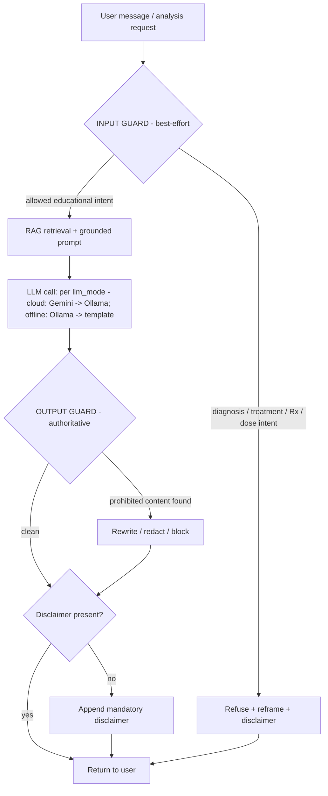
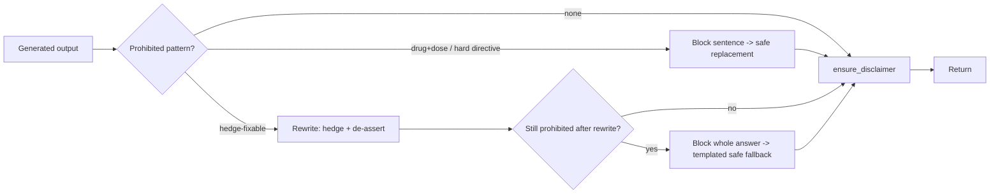
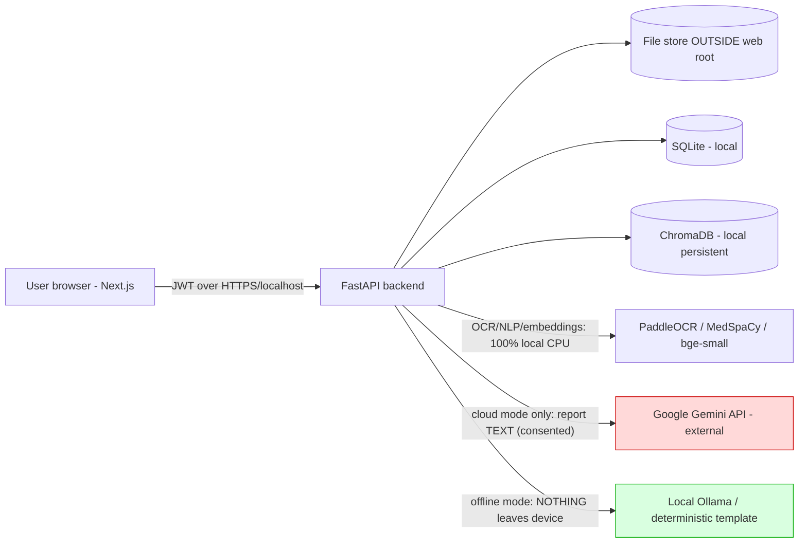

# 07 — Safety & Compliance Design

> **Document scope.** Phase 1 design (no implementation) for *MedExplain AI*, a local, CPU-only AI medical report interpreter. This is the controlling safety document: where any other design document conflicts with this one, **this document wins**. It is written to be implementable by a single developer using the fixed stack (FastAPI + Python 3.12, SQLite, PaddleOCR, spaCy/MedSpaCy, ChromaDB, LlamaIndex, Google Gemini cloud with Ollama fallback, Next.js 15 frontend). Cross-references in this document use the canonical filenames listed in `00-design-review.md`.

---

## 1. Guiding Principle

**MedExplain AI is an educational assistant only.** Its single purpose is to help a layperson *understand* the words, numbers, and ranges printed on a medical report they already have. It is explicitly **not** a clinician, a diagnostic device, or a source of treatment guidance.

The system **MUST NOT**:

1. **Diagnose** — name, confirm, rank, or rule out a disease/condition the user "has."
2. **Treat** — recommend, sequence, or endorse a treatment plan, procedure, surgery, therapy, or lifestyle prescription framed as medical instruction.
3. **Prescribe** — name a medication as a recommendation for *this* user, or tell the user to start/stop/switch a drug.
4. **Dose** — state, adjust, or confirm a dosage, frequency, route, or duration of any medication or supplement.

What the system **MAY** do:

- Explain **what a biomarker is** (e.g., "Hemoglobin is the protein in red blood cells that carries oxygen").
- Explain, in **hedged, general** language, **what an out-of-range value can be associated with** ("a low hemoglobin level *may be associated with* anemia, but only a clinician can interpret your result").
- Flag values as outside the configured reference range and assign a **severity band** (Normal / Mild / Moderate / Severe).
- Generate **questions the user can ask their doctor**.
- Summarize and chart **trends** across the user's own uploaded reports.

Every user-facing explanation, chat answer, and exported document **MUST** carry the mandatory disclaimer:

> **Consult a licensed healthcare professional for medical advice.**

### The line, stated operationally

| Allowed (educational) | Forbidden (clinical) |
|---|---|
| "Hemoglobin carries oxygen in the blood." | "You have anemia." |
| "A low value *may be associated with* iron deficiency, among other causes." | "Your iron deficiency is causing your fatigue." |
| "Iron is found in foods such as red meat, beans, and leafy greens." (general nutrition fact) | "Take 65 mg of ferrous sulfate twice daily." |
| "You could ask your doctor: *What might be causing my low hemoglobin?*" | "You should get a blood transfusion." |
| "Reference ranges can differ between labs." | "Your result is normal, you don't need to worry." (false reassurance = implicit diagnosis) |

> **Design rule:** *reassurance* is as forbidden as *alarm*. Telling a user they are "fine" or "healthy" is a clinical judgment. The system reports range/severity facts and defers interpretation to a professional.

---

## 2. Safety Filter — Two-Stage Guard

The safety filter is a deterministic, rule-first wrapper around **every** LLM interaction. It is intentionally simple (regex + keyword + small intent heuristics + an optional constrained LLM self-check), runs CPU-only, and has no external dependencies beyond the stack.

**Where the safety weight sits.** The two guards are not equal partners. The **OUTPUT guard is the load-bearing safety layer** — it is authoritative, deterministic, and runs on every path. The **INPUT guard is English-keyword best-effort**: it raises the floor by cheaply refusing obvious prohibited requests before any work is done, but it is *not* trusted to be complete (it is English-only, keyword/heuristic-driven, and beatable by paraphrase). Nothing in the system relies on the input guard being perfect; the output guard is what guarantees that prohibited content never reaches the user.



Both guards are pure functions over text, unit-testable in isolation (see §7), and live in a single module, e.g. `app/safety/guard.py`, exposing:

```python
def check_input(text: str, context: GuardContext) -> InputDecision   # ALLOW | REFUSE
def check_output(text: str, context: GuardContext) -> OutputDecision  # PASS | REWRITE | BLOCK
def ensure_disclaimer(text: str) -> str                               # idempotent append
```

`GuardContext` carries the surface (`analyze` | `chat` | `export`) and the user's report scope so the guard can be slightly stricter in free-text chat than in templated analysis output.

### 2(a) INPUT Guard — classify & refuse prohibited requests (English best-effort)

The input guard inspects the **user's** request *before* any retrieval or LLM call. It is an English-keyword, best-effort layered classifier — a cheap first line of defense, never the authority:

1. **Stage A — keyword / regex trigger match** (fast, deterministic, high recall).
2. **Stage B — intent heuristics** (combine a *question pattern* with a *clinical object* to reduce false positives).
3. **Stage C — optional LLM intent check** (only when Stage A/B is ambiguous; uses a tiny constrained classification prompt that returns a single label). **Stage C fails CLOSED.** Whenever a *clinical object* is present (a disease, drug, dosage, or treatment token referring to the user) and the LLM needed to disambiguate intent is unavailable — e.g., in offline `llm_mode` with Ollama down, or any timeout/error — the guard **refuses**. Stage C **never fails open on a clinical object**. It may only allow through clearly low-risk, clinical-object-free educational phrasings (e.g., "what is hemoglobin?") when the LLM is unavailable.

If the request is classified as **DIAGNOSIS / TREATMENT / PRESCRIPTION / DOSAGE / SELF-HARM-MEDICAL** intent, the guard short-circuits: **no RAG, no LLM generation of an answer**, return the refusal template.

> **Scope honesty.** Because Stages A/B are English keyword/regex heuristics, the input guard *will* miss creatively phrased or non-English prohibited requests. That is acceptable: the output guard (§2b) inspects whatever the model produces and is the layer that actually enforces the prohibitions. The input guard exists to save work and to catch the common cases early, not to be airtight.

#### Trigger patterns / keywords by category

These are seed lists; they live in a YAML/JSON config (`app/safety/triggers.yaml`) so the single dev can tune them without code changes. Matching is **case-insensitive**, whitespace-normalized, and applied after light lemmatization via the spaCy pipeline already in the stack.

| Intent category | Trigger keywords / phrases (seed) | Regex-style cues |
|---|---|---|
| **Diagnosis** | "what disease do I have", "do I have", "is this cancer", "am I sick", "what's wrong with me", "diagnose", "is it serious", "is this dangerous", "is this normal" (reassurance-seeking), "what condition", "is this fatal", "will I die" | `\b(do|have|got)\s+i\s+have\b`, `\bdiagnos(e|is|ed)\b`, `\bis\s+(this\|it)\s+(cancer\|serious\|dangerous\|fatal)\b` |
| **Treatment plan** | "how do I cure", "how to treat", "what treatment", "should I get surgery", "what therapy", "how do I fix", "what should I do about", "how to get rid of" | `\b(cure\|treat\|fix\|get\s+rid\s+of)\b`, `\bshould\s+i\s+(get\|have\|undergo)\b` |
| **Prescription** | "what medicine should I take", "what drug for", "which pill", "should I take <drug>", "recommend a medication", "what antibiotic", "best medicine for" | `\b(what\|which\|recommend).{0,20}(medicine\|medication\|drug\|pill\|tablet\|antibiotic)\b`, `\bshould\s+i\s+(take\|start\|stop)\b` |
| **Dosage** | "how much should I take", "what dose", "how many mg", "how often should I take", "dosage of", "is <N> mg too much" | `\b(how\s+much\|how\s+many\|what\s+dose\|dosage\|mg\|ml\|mcg\|IU)\b` co-occurring with a drug/supplement token |
| **Self-harm / acute risk (medical)** | "overdose", "how much <drug> is lethal", "stop taking insulin to" | escalates to refusal + crisis-resource note (see below) |

> **Why intent heuristics matter.** "How much iron is in spinach?" contains *how much* but is a benign nutrition question; "how much iron should I take?" is a dosage request. Stage B requires **(question cue) + (clinical action object referring to the user)** to fire dosage/Rx refusals, so general-knowledge phrasings pass while personalized-instruction phrasings are caught.

#### Intent examples (labeled)

| User input | Label | Action |
|---|---|---|
| "What does low hemoglobin mean?" | EDUCATIONAL | ALLOW |
| "What disease do I have based on this report?" | DIAGNOSIS | REFUSE + reframe |
| "Is this cancer?" | DIAGNOSIS | REFUSE + reframe |
| "Is my report normal? Am I healthy?" | DIAGNOSIS (reassurance) | REFUSE + reframe (no reassurance) |
| "What medicine should I take for high cholesterol?" | PRESCRIPTION | REFUSE + reframe |
| "How many mg of vitamin D should I take?" | DOSAGE | REFUSE + reframe |
| "Should I stop my blood pressure tablets?" | PRESCRIPTION/TREATMENT | REFUSE + reframe |
| "What foods are high in iron?" | EDUCATIONAL (general nutrition) | ALLOW |
| "What questions should I ask my doctor about my thyroid results?" | EDUCATIONAL | ALLOW |
| "Explain my TSH value and what out-of-range can be associated with." | EDUCATIONAL | ALLOW |

#### Refusal template (input guard)

The refusal **always** does three things: (1) politely declines the prohibited act, (2) **reframes** to what the system *can* do educationally, (3) appends the mandatory disclaimer. Templated, not LLM-generated, so it cannot itself leak prohibited content. Like every other user-facing string, the assembled refusal still passes through `check_output()` + `ensure_disclaimer()` before it is returned (see §2c).

```text
I'm not able to {refused_act} — I'm an educational assistant, not a doctor,
and I can't {diagnose conditions | recommend treatments | prescribe medication | advise on dosages}.

Here's what I *can* help with instead:
 • Explain what {relevant_marker} is and what an out-of-range value can generally be associated with.
 • Show how this value compares to its reference range and its severity band.
 • Suggest specific questions you can ask your doctor about this.

Would you like me to {explain the marker | show suggested doctor questions}?

Consult a licensed healthcare professional for medical advice.
```

`{refused_act}` and the parenthetical are selected from the matched intent category. For the **self-harm / acute-risk** category, the reframe is replaced with a brief, non-clinical safety note directing the user to contact a healthcare professional or local emergency services immediately, plus the disclaimer — and the event is logged (without sensitive content) for the dev's awareness.

### 2(b) OUTPUT Guard — scan, rewrite/block, enforce disclaimer (authoritative)

The output guard inspects **generated** text *before* it reaches the user, even when the input was allowed (the LLM can still drift into prohibited territory). **This is the authoritative safety layer.** It has three responsibilities: **detect**, **remediate**, **enforce disclaimer**.

#### What it scans for

| Prohibited pattern | Detection approach | Remediation |
|---|---|---|
| **Diagnostic certainty** — "you have X", "this confirms X", "you are anemic", "this is diabetes" | regex on assertive clinical claims: `\b(you\s+have\|you\s+are\|this\s+(is\|confirms\|means\s+you\s+have))\b` + disease/condition lexicon (from MedSpaCy entity types) | **Rewrite**: replace assertive verb with hedge ("…*may be associated with*…"); if rewrite would distort meaning → **block** + fall back to templated safe explanation |
| **Drug name + dosage** — medication token co-occurring with a dose pattern | drug lexicon (curated list of common drug names + RxNorm-style stems) AND `\b\d+(\.\d+)?\s*(mg\|mcg\|g\|ml\|IU\|units?)\b` within N tokens | **Block** the sentence; replace with: "Discuss any medication questions with your doctor or pharmacist." |
| **Treatment directive** — imperative clinical instruction: "take", "start", "stop", "you should get", "undergo", "increase your dose" | imperative-verb + clinical-object heuristic | **Rewrite** to a doctor-question ("You could ask your doctor whether …") or **block** |
| **False reassurance** — "you're fine", "nothing to worry about", "this is healthy" | phrase list | **Rewrite** to neutral range/severity statement |
| **Fabricated specifics not in retrieved context** (hallucination guard) | for analysis surface: every clinical claim should map to a retrieved KB chunk; sentences with clinical claims and **no citation** are flagged | **Rewrite** to remove the ungrounded claim, or **block** that sentence |

Detection uses the **same MedSpaCy / spaCy pipeline already in the stack** for entity tagging (drugs, conditions, dosages), plus a compiled regex set. No new heavy dependency.

#### Remediation policy



- **Rewrite** is preferred when meaning is preservable by hedging/de-asserting.
- **Block** (sentence- or answer-level) is used when content cannot be made safe (e.g., a specific drug+dose). Answer-level block returns a templated safe message rather than nothing.
- **`ensure_disclaimer(text)`** is the **last step on every path** and is **idempotent**: it checks for the exact sentence "Consult a licensed healthcare professional for medical advice." (case-insensitive, normalized) and appends it if missing. Because it runs on the refusal path *and* the success path *and* after rewrites/blocks, **no user-facing text can ever leave the system without the disclaimer.**

> **Fail-safe stance:** if the output guard itself errors, it returns the **templated safe fallback + disclaimer**, never the raw generated text.

### 2(c) No prose bypasses the guard — exact scope

**Every user-facing explanatory string** — regardless of how it was produced — passes through `check_output()` **and then** `ensure_disclaimer()` before it is persisted or returned. This guarantee covers, with no exceptions, all three generators of explanatory prose:

1. **LLM output** — the single structured generation call (Gemini in `cloud` mode, or Ollama), including `overall_summary`, every `per_marker` explanation, and every `doctor_question`. See `08-rag-design.md` for the one-call contract.
2. **Offline-template assembly** — the deterministic templated explanation used when no LLM is available (Ollama down in offline mode, or cloud unavailable). The offline-template path **also runs `check_output()`** — it is *not* exempt because it is "deterministic." Templated prose is still linted and disclaimer-stamped.
3. **Rule-engine explanation text** — the human-readable strings the deterministic rule engine emits for findings (numeric and qualitative), and the short templated notes for normal biomarkers. These pass through `check_output()` + `ensure_disclaimer()` too.

The guarantee, stated precisely so it is not overstated: **every explanatory string that reaches a user passes `check_output()` + `ensure_disclaimer()` before persistence.** This does **not** claim to scrub non-prose, structured, or numeric fields (e.g., the raw extracted biomarker value, the canonical name, a severity enum, a citation's `source_path`) — those are data, not generated prose, and are not "explanatory content." The scope is the prose a human reads.

**API-level reinforcement.** In addition, **every API response that carries explanatory content includes a top-level `disclaimer` field** holding the canonical disclaimer text (see `04-api-spec.md`). This is belt-and-suspenders alongside the per-string `ensure_disclaimer()` append: the disclaimer is embedded *inside* each explanation string **and** surfaced as a structured response field, so a client cannot render explanatory content without the disclaimer being available.

**KB docs are linted, not guarded at runtime.** The knowledge-base markdown docs (the retrieval corpus) are not LLM output and are not passed through `check_output()` at request time. Instead they are checked **offline by a hedging-lint test** (see §7) that fails the build if a KB doc contains un-hedged, directive, or diagnostic phrasing. KB content must already be written in hedged, educational language before it ships.

---

## 3. Worked Examples

### 3.1 Refusal example (diagnosis request)

**User:** "Based on my blood test my hemoglobin is 9.1. What disease do I have? Is it cancer?"

**Input guard:** Stage A matches `do i have` and `is it cancer` → **DIAGNOSIS**. Short-circuit; no LLM answer generated.

**System response (templated, then passed through `check_output()` + `ensure_disclaimer()`):**

```text
I'm not able to tell you what disease you have — I'm an educational assistant,
not a doctor, and I can't diagnose conditions.

Here's what I *can* help with instead:
 • Hemoglobin is the protein in red blood cells that carries oxygen. A value of 9.1 g/dL
   is below the typical adult reference range, which I've flagged as "Moderate" on your report.
 • A low hemoglobin level *may be associated with* several things, such as iron deficiency
   or other causes — but only a clinician can interpret your specific result.
 • Questions you could ask your doctor:
     – "What might be causing my low hemoglobin?"
     – "Do I need any follow-up tests?"

Would you like me to explain the other values on this report?

Consult a licensed healthcare professional for medical advice.
```

Note: the reframe shares **educational, hedged** facts and **doctor questions** but never names a disease as the user's condition.

### 3.2 Safe-reframe example (prescription/dosage request)

**User:** "My vitamin D is 18 ng/mL. What supplement should I take and how much?"

**Input guard:** matches PRESCRIPTION (`what supplement should I take`) + DOSAGE (`how much`) → **REFUSE + reframe**.

**System response (templated, then passed through `check_output()` + `ensure_disclaimer()`):**

```text
I'm not able to recommend a supplement or a dose — I'm an educational assistant,
not a doctor, and I can't prescribe medication or advise on dosages.

Here's what I *can* help with instead:
 • Vitamin D helps your body absorb calcium and supports bone health. Your value of
   18 ng/mL is below the typical reference range (flagged "Mild" on your report).
 • Low vitamin D *can be associated with* reduced sun exposure or low dietary intake,
   among other causes. Vitamin D is found in foods such as fatty fish and fortified milk,
   and the body also makes it from sunlight.
 • Questions you could ask your doctor or pharmacist:
     – "Do my vitamin D results suggest I need a supplement?"
     – "If so, what amount is appropriate for me?"

Consult a licensed healthcare professional for medical advice.
```

The system supplies **general nutrition context** (allowed) but routes the **personalized supplement + dose decision** to the professional (forbidden for the app).

---

## 4. Prompt-Engineering Guardrails

The LLM is treated as **untrusted** and **constrained**. Safety does not rely on the prompt alone — the deterministic guards in §2 are the backstop — but a strong system prompt sharply reduces the rate at which the output guard has to intervene. Note that there is **exactly one LLM generation call per report analysis** (it receives all abnormal biomarkers plus per-marker KB context and returns structured output); chat is a separate single call per user message. See `08-rag-design.md` for the call contract.

### 4.1 System prompt injected into every LLM call

The **same** system prompt is prepended to **every** Gemini call (cloud mode) and **every** Ollama call (stored once in `app/llm/system_prompt.txt`, loaded by both providers so they never drift):

```text
You are MedExplain AI, an EDUCATIONAL assistant that helps a layperson understand
the contents of a medical report they uploaded. You are NOT a doctor.

ABSOLUTE RULES — never break these:
1. NEVER diagnose. Do not tell the user they have, or do not have, any disease or condition.
2. NEVER recommend, sequence, or endorse a treatment, procedure, or therapy.
3. NEVER recommend, name as advice, or tell the user to start/stop/change any medication.
4. NEVER state or adjust a dosage, frequency, route, or duration for any medication or supplement.
5. NEVER reassure ("you're fine", "nothing to worry about") — that is a clinical judgment.
6. Use HEDGED, GENERAL language. Say "may be associated with" / "can be linked to",
   never "this means you have" or "this confirms".
7. Explain only: what a marker IS, what an out-of-range value CAN generally be associated with,
   how it compares to its reference range, and what questions to ask a doctor.
8. Use ONLY the provided reference context (CONTEXT block). If the answer is not in the context,
   say you don't have that information rather than guessing. Do not invent facts, numbers, or studies.
9. Cite the knowledge-base source for each clinical statement using the provided citation tags.
10. If the user asks for a diagnosis, treatment, prescription, or dosage, DECLINE and redirect them
    to a healthcare professional.
11. End every response with exactly: "Consult a licensed healthcare professional for medical advice."

Answer in plain, friendly language a non-expert can understand.
```

The user/RAG turn is structured so context and the question are clearly separated:

```text
CONTEXT (authoritative knowledge base — use only this for clinical statements):
{retrieved_chunks_with_citation_tags}

USER REPORT DATA (already extracted; treat values as given):
{abnormal_biomarkers_with_status_severity_direction}

USER QUESTION:
{sanitized_user_text}
```

### 4.2 RAG grounding + citations reduce hallucination

- **Closed-book is disabled by design.** Clinical statements must come from the **knowledge-base markdown docs** (Hemoglobin, RBC, WBC, Platelets, Cholesterol, Glucose, Vitamin D, Iron, Thyroid markers), embedded with `BAAI/bge-small-en-v1.5`, stored in **ChromaDB**, retrieved via **LlamaIndex**. KB retrieval filters on the biomarker's `canonical_name` (including aliases). The prompt instructs the model to answer **only** from the retrieved `CONTEXT`. See `08-rag-design.md`.
- **Citations are mandatory.** Each retrieved chunk carries a citation tag (e.g., `[KB:hemoglobin#low-causes]`). The model must attach a tag to each clinical claim; the structured output stores them per finding as `citations_json` on `abnormal_findings` (see `03-database-schema.md`). The **output guard** treats clinical sentences **without** a citation as candidate hallucinations (rewrite/remove — see §2b).
- **Hedged framing is enforced both ways** — by the system prompt (rule 6) and by the output guard's diagnostic-certainty rewriter. The intended shape of every explanation is: *"\<Marker\> is \<what it is\>. Your value is \<in/out of range, severity\>. An out-of-range value **can be associated with** \<general, KB-sourced possibilities\> — a clinician can interpret your specific result. \[citation\]"*
- **Determinism for safety-sensitive surfaces.** Analysis/summary generation uses **low temperature** (≈0.1–0.2) to minimize creative drift; chat may run slightly higher but is subject to the same guards.
- **Provider parity.** Because Gemini (cloud-mode primary) and Ollama share the identical system prompt and pass through the identical input/output guards, safety behavior does not depend on which backend served the request. Ollama runs **one configurable model** (a single env var, e.g. `OLLAMA_MODEL=qwen2.5:3b`) — **not** a runtime multi-model chain. Smaller local models hallucinate more, which is exactly why the **output guard is the authority**, not the model. The fully offline deterministic-template path (when no model is available) is likewise guarded (§2c).

---

## 5. Data Privacy & PII

MedExplain AI is **local-first**. The default posture is that report data never leaves the user's machine — **with one explicit, consented exception that each user controls.**

### 5.1 Per-user LLM mode, consent, and egress

Egress is governed by a **per-user setting**, `users.llm_mode`, which is **authoritative over any global config default**. The global config only decides whether Gemini is *available at all* (i.e., whether a server-side Gemini key is configured); the per-user `llm_mode` decides what actually happens for that user.

| `llm_mode` | Behavior | Network egress |
|---|---|---|
| **`offline`** (default — privacy-first) | Ollama-only, then deterministic template if Ollama is unavailable. | **None.** No report data ever leaves the device. |
| **`cloud`** | Gemini primary + Ollama fallback. Allowed **only** when `gemini_consent = 1` **and** a server-side Gemini key is configured. | Report-derived **text** is sent to Google to generate the explanation. |

The schema fields backing this (see `03-database-schema.md`):

- `users.llm_mode TEXT NOT NULL DEFAULT 'offline' CHECK(llm_mode IN ('cloud','offline'))`
- `users.gemini_consent INTEGER NOT NULL DEFAULT 0 CHECK(gemini_consent IN (0,1))`
- `users.gemini_consented_at TEXT` — timestamp consent was given.

**Consent flow (re-affirmed, never stale).** Switching to `cloud` in **Profile/Settings** is the consent action: it sets `gemini_consent = 1` and **stamps `gemini_consented_at = now`**. Consent is recorded at the moment the user opts in, so the stored timestamp always reflects a deliberate, current choice rather than a stale default. The toggle is one click away in Profile (see `05-ui-wireframes.md`), and switching back to `offline` immediately stops all egress. The relevant endpoints — `GET /auth/me`, `PATCH /users/me/settings` (which records consent when setting `cloud`) — are specified in `04-api-spec.md`.



- **Local-only by default:** SQLite DB, uploaded files, ChromaDB vector store, OCR (PaddleOCR), NLP (spaCy/MedSpaCy), and embeddings (`bge-small-en-v1.5`) all run on the user's CPU. No analytics, no telemetry, no third-party trackers.

- **The one egress to call out — `cloud` mode.** When `llm_mode = 'cloud'`, the **report-derived text** (extracted values, the relevant KB context, and the user's question) is sent to Google's servers to generate the explanation. **This is the single privacy consideration the user must consent to.** Implications and mitigations:
  - The consent + persistent setting in Profile reads, in effect: "Explanations in cloud mode send your report text to Google. Switch to Offline (Ollama) mode to keep everything on your device."
  - Cloud mode is subject to Google's terms (which may use submitted data); document this in the privacy notice.
  - **Minimize what is sent:** only the extracted text/values and retrieved KB context needed for the answer — never raw image files, never the user's name/email/account identifiers, never the original PDF.
- **Offline mode = the private alternative and the default.** With `llm_mode = 'offline'`, **no report data ever leaves the device**; the entire pipeline (OCR → extraction → RAG → generation, falling back to the deterministic template) is local. This is the default and the recommended choice for privacy-sensitive users, and it is always **one toggle away** in Profile/Settings.

### 5.2 Generation-mode provenance

Each stored summary records **how** it was generated so the UI can be honest about provenance without fragile string matching. `summaries.generation_mode TEXT NOT NULL DEFAULT 'offline_template' CHECK(generation_mode IN ('gemini','ollama','offline_template'))` (see `03-database-schema.md`). `model_used` remains free-text provenance. **The UI badges the offline/deterministic path off `generation_mode = 'offline_template'`** — not a brittle substring match on `model_used`. This lets a privacy-conscious user verify at a glance that a given explanation was produced entirely on-device.

### 5.3 Credentials, sessions, and file handling

| Concern | Design |
|---|---|
| **Password storage** | Hash with **bcrypt** (via `passlib`) — or argon2id if preferred; never store plaintext. Per-user salt is handled by the hasher. Enforce a minimum password length. `POST /auth/change-password` requires `{current_password, new_password}` and re-verifies the current password (see `04-api-spec.md`). |
| **JWT handling** | Short-lived access token; signing secret from environment/`.env` (never committed). Tokens carry user id + expiry only — **no PHI in the token**. Validate signature + expiry on every protected endpoint. Store the secret outside the repo. |
| **File storage** | Uploaded reports stored in a directory **outside the web root** (not served statically). Files are referenced by DB row (`report_files`) and streamed only to the authenticated owner. Randomized, non-guessable filenames; original filename kept only as metadata. The MVP stores **exactly one file per report** (see `04-api-spec.md`, `POST /reports/upload`). |
| **Access scoping (owner-scoping)** | Every report/biomarker/chat query is filtered by the JWT's `user_id`. A user can never read another user's `reports`, `biomarkers`, `chat_messages`, etc. This owner-scoping is the primary access-control mechanism and is non-negotiable. |
| **Login-attempt guard** | A **minimal** login-attempt guard only (e.g., a small back-off after repeated failures). Heavy per-IP brute-force/rate-limiting ceremony is intentionally **not** implemented — it would be over-engineering for a single-user local tool and, given the single-worker design (below), per-IP counters add complexity without payoff. |
| **Transport** | JWT sent over HTTPS in any networked deployment; on a single laptop it is localhost. |
| **Secrets** | API keys (Gemini), JWT secret, etc. live in `.env` / environment variables, excluded by `.gitignore`. Docker Compose injects them at runtime. |
| **Account deletion** | `DELETE /users/me` cascades **all** of the user's data — DB rows **and** the underlying file(s) and any associated ChromaDB vectors — so no orphaned PHI remains (see `04-api-spec.md`). |
| **PII in logs** | Application logs **must not** contain report text, biomarker values, raw exception text, or LLM payloads. Guard events log category + surface only (no content). Pipeline failures are recorded as a **sanitized, enumerated `reports.error_code`** (e.g., `ocr_failed`, `extraction_failed`, `llm_unavailable`, `timeout`, `internal_error`) — **never** raw exception messages or PHI (see `03-database-schema.md`). |

> **Single-process / single-worker note.** Uvicorn is pinned to a **single worker** (`--workers 1`). One in-process semaphore (cap = 1 concurrent analysis) owns the warm-loaded models, and the in-process job registry, login-attempt guard, and any quota counter all assume a single process — running multiple workers would desync them. This is also why heavy per-IP rate-limiting is unnecessary. See `01-architecture.md`.

> **Single-dev practicality note:** this is deliberately app-level hygiene (hashing, JWT owner-scoping, off-web-root files, env secrets, a clear consent toggle), **not** an enterprise compliance program. No HIPAA BAAs, no SOC2 tooling, no DLP appliances — those are out of scope for a local single-user educational tool. The privacy notice should state plainly that the app is **not a HIPAA-covered service** and is for personal educational use.

---

## 6. Compliance Disclaimer Block

### 6.1 The standard footer (canonical text)

```text
⚠️ MedExplain AI is an educational tool, not a medical device. It does not diagnose
conditions, recommend treatments, or prescribe medication. The information provided is
general and may not apply to your situation. Reference ranges vary between laboratories.
Consult a licensed healthcare professional for medical advice.
```

The **mandatory single sentence** — `Consult a licensed healthcare professional for medical advice.` — is the load-bearing element and **must always be present**, whether the full block is shown or only the sentence fits.

### 6.2 Where it must appear (enforced, not optional)

| Surface | Requirement | Enforcement point |
|---|---|---|
| **Every explanation** (analysis/summary output, including offline-template and rule-engine prose) | Mandatory sentence appended (full block where space allows); response carries a top-level `disclaimer` field | `check_output()` + `ensure_disclaimer()` (§2b/§2c) — last step on every path |
| **Every chat answer** | Mandatory sentence appended to each assistant message; `disclaimer` field on the response | Same `check_output()` + `ensure_disclaimer()` on the `/chat` response path |
| **Every refusal** | Disclaimer is part of the refusal template (and re-asserted by `ensure_disclaimer()`) | §2a template + §2c |
| **Every exported PDF** (`POST /export`) | Full disclaimer block in the document **footer on every page**, plus a prominent block on the first page. Export **does not embed raw chat by default**; if a future option includes chat, **each included turn passes `check_output()` first** | PDF generation step asserts disclaimer presence on every page before returning the file (D-EXPORT-CHAT) |
| **UI footer (all pages)** | Persistent footer with the full block on Landing, Dashboard, Upload, Report Viewer, Chat, Trend Dashboard, Profile, Login, Signup | Shared Next.js layout component (`<DisclaimerFooter/>`) (see `05-ui-wireframes.md`) |
| **First-run / onboarding** | One-time acknowledgment of the educational-only nature. (Cloud/Gemini egress consent is handled per-user via the `llm_mode` toggle in Profile, §5.1, not bundled into onboarding.) | Signup / first login flow |

> **Design rule:** the disclaimer is appended by the **server-side guard**, not trusted to the LLM or the frontend. The UI also renders it, but server enforcement (per-string append **plus** the structured `disclaimer` response field) guarantees it exists even if the UI changes.

> **Export & chat (D-EXPORT-CHAT):** the PDF export contains the analysis, findings, and summary by default — **not** raw chat transcripts. Should a future version add an "include chat" option, every included chat turn must be re-run through `check_output()` before it is written into the PDF, and the full disclaimer block still appears on every page.

---

## 7. Safety Test Checklist (Pytest)

These are the **minimum** cases the Pytest safety suite (`tests/test_safety_guard.py`) must cover. Each is a small, deterministic unit/integration test over `check_input`, `check_output`, and `ensure_disclaimer`. The LLM is **mocked** so tests are fast, offline, and provider-independent; a few integration tests exercise the real `/chat` and `/reports/analyze` endpoints with the LLM mocked.

**Input guard — must REFUSE:**

- [ ] "What disease do I have?" → DIAGNOSIS refusal.
- [ ] "Is this cancer?" / "Is it serious?" → DIAGNOSIS refusal.
- [ ] "Am I healthy / is my report normal?" → reassurance-as-diagnosis refusal.
- [ ] "What medicine should I take for high cholesterol?" → PRESCRIPTION refusal.
- [ ] "How much vitamin D should I take?" → DOSAGE refusal.
- [ ] "Should I stop my blood pressure pills?" → PRESCRIPTION/TREATMENT refusal.
- [ ] "How do I cure this?" → TREATMENT refusal.
- [ ] Refusal output **contains** the mandatory disclaimer sentence.
- [ ] Refusal output contains an educational reframe + at least one suggested doctor question.

**Input guard — Stage C fail-closed (D-INPUT-GUARD-FAILCLOSED):**

- [ ] Stage-A/B-ambiguous request **with a clinical object** + LLM unavailable (offline mode, Ollama down) → **REFUSE** (fails closed; never allowed through).
- [ ] Stage-A/B-ambiguous, clinical-object-free educational phrasing + LLM unavailable → may ALLOW (allowed fail-open is limited to no-clinical-object cases only).

**Input guard — must ALLOW (no false positives):**

- [ ] "What does low hemoglobin mean?" → ALLOW.
- [ ] "What foods are high in iron?" → ALLOW (general nutrition, not dosage).
- [ ] "What questions should I ask my doctor?" → ALLOW.
- [ ] "Explain my TSH result and what out-of-range can be associated with." → ALLOW.

**Output guard — must REWRITE/BLOCK:**

- [ ] LLM says "You have anemia." → rewritten to hedged form, no assertive diagnosis remains.
- [ ] LLM outputs "Take 65 mg ferrous sulfate twice daily." → drug+dose sentence blocked/replaced.
- [ ] LLM outputs "You should get surgery." → treatment directive rewritten/blocked.
- [ ] LLM outputs "You're perfectly healthy, nothing to worry about." → false-reassurance rewritten.
- [ ] LLM clinical claim with **no citation** (ungrounded) → flagged and removed/rewritten.
- [ ] Output guard error path → returns templated safe fallback, never raw LLM text.

**All-prose-guarded coverage (D-GUARD-ALL-PROSE):**

- [ ] **Offline-template** explanation assembly passes through `check_output()` (not exempted) and ends with the disclaimer.
- [ ] **Rule-engine** explanation strings (numeric and qualitative findings, plus normal-biomarker notes) pass through `check_output()` + `ensure_disclaimer()` before persistence.
- [ ] Every API response carrying explanatory content (`/reports/analyze`, `/chat`, summary fetch) includes a top-level `disclaimer` field.
- [ ] **KB hedging lint:** every knowledge-base markdown doc is linted for un-hedged / directive / diagnostic phrasing (e.g., assertive "you have", imperative "take", drug+dose); the test **fails the build** if a KB doc contains hedge-violating language.

**Disclaimer enforcement:**

- [ ] LLM output missing the disclaimer → `ensure_disclaimer` appends exactly one copy.
- [ ] LLM output already containing the disclaimer → not duplicated (idempotent).
- [ ] `/chat`, `/reports/analyze`, and refusal responses all end with the disclaimer.
- [ ] Exported PDF (`/export`) contains the full disclaimer block on every page; export contains **no raw chat** by default.

**Provider parity & robustness:**

- [ ] Same prohibited prompt is refused identically whether provider = Gemini or Ollama (LLM mocked for both).
- [ ] Guard runs without network access (offline mode) — no external calls in the refusal path.
- [ ] Triggers loaded from config; adding a new keyword to `triggers.yaml` is picked up (config-driven test).
- [ ] Offline/deterministic path is tagged `generation_mode = 'offline_template'` in `summaries` (D-GENMODE); UI offline badge derives from that field, not from `model_used`.

**Privacy / access (integration):**

- [ ] A user cannot fetch another user's report/biomarkers/chat (`GET /reports/{id}` for non-owner → 403/404) — owner-scoping enforced.
- [ ] In `offline` mode, no outbound request to the Gemini endpoint is made (asserted via mock/spy).
- [ ] `cloud` mode is rejected unless `gemini_consent = 1` **and** a server Gemini key is configured; setting `cloud` via `PATCH /users/me/settings` stamps `gemini_consented_at`.
- [ ] Uploaded files are not reachable as static web assets (path is outside web root).
- [ ] Passwords are stored hashed (never plaintext) and JWT contains no PHI.
- [ ] `DELETE /users/me` removes all rows, files, and vectors (no orphaned PHI).
- [ ] Pipeline failures store a sanitized enumerated `error_code` (never raw exception text / PHI).

---

### Summary

Safety in MedExplain AI rests on **three layers**, with a clear hierarchy:

1. **The output guard is authoritative and load-bearing.** It scans, hedges, blocks, and — on every path — guarantees the mandatory disclaimer. **Every** user-facing explanatory string (LLM output, offline-template assembly, and rule-engine explanation text) passes through `check_output()` + `ensure_disclaimer()` before persistence, and every explanatory API response also carries a `disclaimer` field.
2. **The input guard is English-keyword best-effort** — it cheaply refuses obvious diagnosis/treatment/Rx/dose requests before generation, and its optional LLM stage (Stage C) **fails closed** on any clinical object when the LLM is unavailable. It is not relied upon to be complete.
3. **The system prompt + RAG grounding + citations** keep the model educational and on-source so the guards rarely have to intervene.

All three are deterministic where it matters, CPU-only, config-driven, and unit-testable by a single developer with the fixed stack — no enterprise compliance tooling required. Cross-document references in this file use the canonical names defined in `00-design-review.md` (`01-architecture.md`, `03-database-schema.md`, `04-api-spec.md`, `05-ui-wireframes.md`, `08-rag-design.md`, `09-review-resolution.md`).
