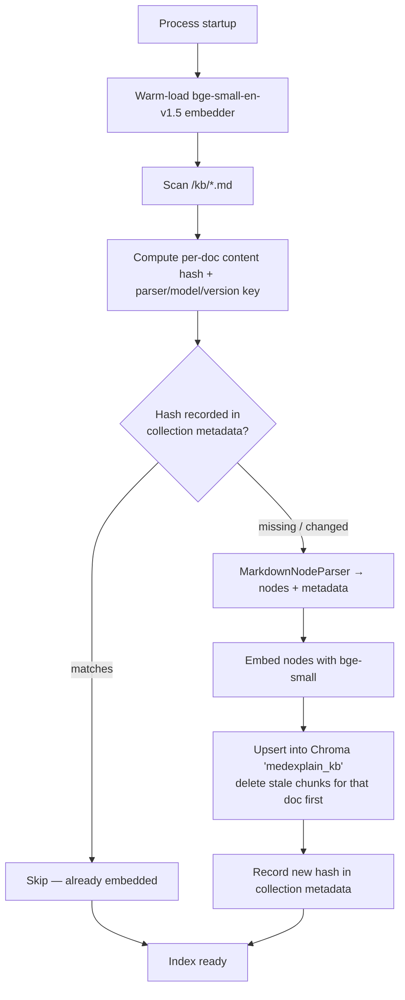
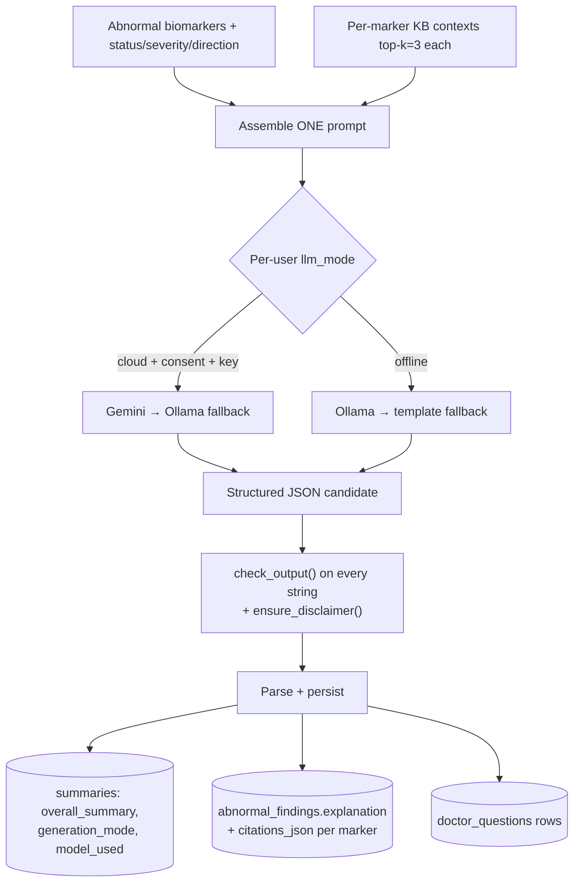

# 08 — RAG Design

> **Document scope.** Phase 1 design (no implementation) for *MedExplain AI*, the local, CPU-only educational medical-report interpreter. This document specifies the Retrieval-Augmented Generation subsystem end to end: the knowledge base and its authoring conventions, chunking, embedding and vector storage, retrieval (metadata-filtered on canonical biomarker name), the single structured generation call per report, the chat retrieval path, citation handling, the offline-template degradation floor, and CPU/latency characteristics. It conforms to the controlling safety rules in `07-safety-and-compliance.md` (which wins on any conflict), the data model in `03-database-schema.md`, the routing/runtime model in `01-architecture.md`, and the endpoints in `04-api-spec.md`. Cross-references use the canonical filenames listed in `00-design-review.md`.

The fixed stack for this subsystem: **LlamaIndex** (ingestion, parsing, retrieval orchestration), **`BAAI/bge-small-en-v1.5`** embeddings (384-dim, CPU, local via `HuggingFaceEmbedding`), **ChromaDB** (local persistent vector store), and the per-user-aware **LLM router** (Google Gemini in consented `cloud` mode, Ollama otherwise, deterministic template floor). No GPU, no hosted vector DB, no reranker — by design.

---

## 1. Knowledge Base

### 1.1 The corpus

The knowledge base is a small, curated set of educational markdown documents living on the local filesystem under `/kb/*.md`. There are **nine biomarker topics**, but — because thyroid is a multi-marker panel — they are authored across the following files:

| # | File | Topic | Canonical key(s) covered |
|---|---|---|---|
| 1 | `kb/hemoglobin.md` | Hemoglobin | `hemoglobin` |
| 2 | `kb/rbc.md` | Red Blood Cells | `rbc` |
| 3 | `kb/wbc.md` | White Blood Cells | `wbc` |
| 4 | `kb/platelets.md` | Platelets | `platelets` |
| 5 | `kb/cholesterol.md` | Cholesterol | `cholesterol` (+ `ldl`, `hdl`, `triglycerides` sections where applicable) |
| 6 | `kb/glucose.md` | Glucose | `glucose` |
| 7 | `kb/vitamin_d.md` | Vitamin D | `vitamin_d` |
| 8 | `kb/iron.md` | Iron | `iron` (+ `ferritin` section where applicable) |
| 9 | `kb/thyroid_markers.md` | Thyroid markers | `tsh`, `free_t4`, `free_t3`, `total_t4` |

These map one-to-one to the markers the rule engine and extractor handle. The corpus is intentionally tiny (nine files, on the order of tens to low-hundreds of chunks once parsed) so the whole index lives in memory and retrieval is sub-second on CPU.

### 1.2 Authoring conventions (stable `##` headings)

Every KB doc is authored to a **fixed section template** using stable `##` headings, so heading-aware chunking produces predictable, individually-retrievable nodes and so citations render as a clean `doc_title › section` string:

```markdown
---
canonical_name: hemoglobin
aliases: [hb, hgb, "haemoglobin", "hemoglobin"]
doc_title: Hemoglobin
---

# Hemoglobin

## What it measures
Hemoglobin is the protein in red blood cells that carries oxygen ...

## Typical reference range
Reference ranges vary between laboratories and by age/sex ...

## Why it may be high
A higher-than-typical value can be associated with ...

## Why it may be low
A lower-than-typical value can be associated with ... (e.g. iron deficiency, among other causes) ...

## Lifestyle and dietary factors
General, non-prescriptive context: iron is found in foods such as ...

## Questions for your doctor
- What might be causing my out-of-range hemoglobin?
- Do I need any follow-up tests?
```

Authoring rules (enforced by the hedging lint in §8):

- **Hedged, educational language only.** "*can be associated with*", "*may be linked to*" — never "you have", never imperatives ("take", "start"), never drug+dose. The KB is the retrieval corpus the model is told to ground on, so un-hedged KB text would propagate into explanations. KB docs are linted offline at build time (§8); they are **not** passed through `check_output()` at request time (they are source content, not generated prose) — see `07-safety-and-compliance.md` §2c.
- **Stable heading set.** The `## Why it may be high` / `## Why it may be low` split lets retrieval and the model align an explanation to the finding's `direction` (`low`/`high`).
- **Self-contained sections.** Each section stands alone (a chunk should make sense without its siblings), since chunks are retrieved individually.

### 1.3 Per-section canonical tagging and the thyroid split (D-NORMALIZE)

Per **D-NORMALIZE**, every retrievable unit is tagged with a **canonical biomarker key plus its aliases**, so retrieval can be scoped to exactly one marker. Single-marker docs carry the canonical key in YAML front-matter (above) and it is propagated to every chunk's metadata.

**The thyroid doc is split into per-marker sections**, which fixes the prior thyroid/synonym retrieval gap (where a single undifferentiated "thyroid" doc returned TSH chunks for a Free T4 query and vice-versa). `kb/thyroid_markers.md` uses a **two-level heading scheme**: a top-level `##` per marker, then the standard `###` sub-sections, and **per-section front-matter-style tags** (an HTML-comment metadata marker the ingestion step reads) so each marker's chunks are tagged with their *own* canonical key:

```markdown
# Thyroid Markers

## TSH (Thyroid-Stimulating Hormone)
<!-- canonical_name: tsh; aliases: [tsh, "thyroid stimulating hormone", "thyrotropin"] -->
### What it measures
TSH is produced by the pituitary gland and signals the thyroid ...
### Why it may be high
...
### Why it may be low
...

## Free T4
<!-- canonical_name: free_t4; aliases: [free_t4, "ft4", "free thyroxine"] -->
### What it measures
...

## Free T3
<!-- canonical_name: free_t3; aliases: [free_t3, "ft3", "free triiodothyronine"] -->
### What it measures
...

## Total T4
<!-- canonical_name: total_t4; aliases: [total_t4, "t4", "thyroxine", "total thyroxine"] -->
### What it measures
...
```

The ingestion step assigns each node the `canonical_name`/`aliases` of the **nearest enclosing marker heading** (the most recent `<!-- canonical_name: ... -->` marker above it), so a Free T4 query filters to only the Free T4 sections. The same enclosing-marker rule applies to any other multi-marker doc (e.g. the LDL/HDL/triglycerides sections of `cholesterol.md`, or the ferritin section of `iron.md`).

---

## 2. Chunking

Chunking is **heading-aware** via LlamaIndex's `MarkdownNodeParser`:

- The parser splits each doc at markdown headings, producing one node per leaf section (`## What it measures`, `## Why it may be low`, …; for the thyroid/multi-marker docs, per `### sub-section` under each marker).
- Any section that exceeds the window budget falls back to a **sentence-window split of ~512 tokens with ~64-token overlap** (`SentenceSplitter`), so an unusually long section is divided without losing local context across the boundary.
- Headings are retained in node text/metadata so the section label is available for citations.

**Chunk metadata (attached to every node):**

```json
{
  "canonical_name": "hemoglobin",
  "aliases": ["hb", "hgb", "haemoglobin", "hemoglobin"],
  "doc_title": "Hemoglobin",
  "section": "Why it may be low",
  "source_path": "kb/hemoglobin.md"
}
```

`canonical_name` + `aliases` drive the retrieval filter (§4); `doc_title` + `section` + `source_path` drive citations (§7). Metadata is stored alongside each vector in ChromaDB so it is available both for filtering and for assembling the cited context — no second lookup.

---

## 3. Embedding & Storage

| Step | Choice | Notes |
|---|---|---|
| Embedding model | `BAAI/bge-small-en-v1.5` (384-dim) | CPU-friendly (~130 MB), run locally via LlamaIndex `HuggingFaceEmbedding`. **Warm-loaded once at startup** alongside the OCR / spaCy / MedSpaCy models (see `01-architecture.md` §6). |
| Vector store | ChromaDB **local persistent** collection `medexplain_kb` | One on-disk directory; no separate service. Stores vector + the metadata in §2. |
| Distance | cosine similarity over normalized embeddings | bge models are trained for cosine; LlamaIndex's Chroma integration handles normalization. |
| Index size | tens–low hundreds of chunks | Fits entirely in memory; sub-second retrieval (§9). |

### 3.1 Idempotent startup ingestion (content-hash gated)

KB ingestion runs **once at container/process startup** and is **idempotent**, gated by a content hash so unchanged docs are never re-embedded:



- The hash key combines each doc's content hash with a small `index_version` (bumped when the chunking strategy or embedding model changes), so a parser/model change forces a clean re-embed even if doc text is unchanged.
- On a changed doc, the indexer **deletes that doc's existing chunks** (matched by `source_path`) before upserting, so edits never leave orphaned stale vectors.
- A first run embeds everything; subsequent runs are near-instant (hash compare only). This keeps startup cheap on a laptop while guaranteeing the index reflects the current KB.

---

## 4. Retrieval

Retrieval is **two-stage: metadata filter first, then vector rank** — deliberately, to prevent cross-marker bleed.

### 4.1 Filter-then-rank

For a given biomarker, the retriever:

1. **Filters** the ChromaDB query to chunks whose `canonical_name` matches the biomarker's canonical name **or** whose `aliases` contains it. (Chroma `where` metadata filter; aliases are matched so a query keyed on `hgb` still resolves to the `hemoglobin` doc.)
2. **Ranks** the surviving chunks by cosine similarity to the embedded query and returns **top-k = 3**.

The query string is built from the biomarker's **normalized** fields plus its computed finding: e.g. `"hemoglobin 9.1 g/dL low mild anemia education"` (canonical_name + value + canonical_unit + status/severity/direction + the word "education"). Building the query from `canonical_name` (not the raw printed `test_name`) keeps the query vocabulary stable across lab spellings.

```python
# Pseudocode — per abnormal biomarker
flt = MetadataFilters(filters=[
    MetadataFilter(key="canonical_name", value=cano, operator="==")
    # OR alias match — alias list expanded from the shared dictionary
])
nodes = retriever.retrieve(query_str, filters=flt, similarity_top_k=3)
```

### 4.2 Why filter-then-rank prevents cross-marker bleed

Pure vector similarity over a tiny 9-topic corpus is *not* reliable enough on its own: "low" / "may be associated with" / "reference range" phrasing is near-identical across docs, so an unfiltered nearest-neighbor search for a Hemoglobin finding can surface a Glucose "Why it may be low" chunk. Scoping the search to the marker's `canonical_name` **first** guarantees the model only ever sees the *correct* doc's chunks, then similarity picks the most relevant section *within* that doc (e.g. aligning to `Why it may be low` for a low finding). This is the mechanism that closes the thyroid/synonym gap (§1.3): a Free T4 finding retrieves only Free T4 sections, never TSH.

### 4.3 Shared alias dictionary (one source of truth with extraction)

The alias→canonical mapping used by retrieval is the **same dictionary file used by biomarker extraction/normalization** (D-NORMALIZE in `03-database-schema.md`): e.g. `{Hb, HGB, Hgb, Hemoglobin} → hemoglobin`, `{TSH, thyrotropin} → tsh`, `{FT4, free thyroxine} → free_t4`. Extraction writes `biomarkers.canonical_name`; the KB front-matter `aliases` are sourced from the same dictionary; retrieval filters on it. Because one dictionary feeds extraction, KB tagging, and retrieval, a synonym added in one place resolves consistently everywhere — `Hgb` printed on a report normalizes to `hemoglobin`, which filters to the `hemoglobin` KB chunks, which cite "Hemoglobin › …".

### 4.4 What retrieval feeds

Per **D-ONECALL**, retrieval runs **per abnormal biomarker** to collect that marker's top-k KB context, and *all* of those per-marker contexts are gathered **before** any generation. There is no LLM call inside the retrieval loop. Normal biomarkers are **not** retrieved for (they get a deterministic templated note, no KB, no LLM). The collected contexts are then handed to the single report-level generation call (§5).

---

## 5. Generation — One Structured Call Per Report (D-ONECALL)

### 5.1 The contract

Analysis performs **exactly one LLM generation call per report** — *not* one per biomarker. That single call receives **all abnormal biomarkers** (with statuses/severities/directions) plus **the KB context retrieved per abnormal marker**, and returns one **structured** object containing the overall summary, every per-marker explanation with citations, and the doctor questions. Chat is a separate single call per user message (§6). Normal biomarkers never reach the LLM.



Routing (cloud→Gemini→Ollama→template, or offline→Ollama→template) is owned by the LLM router and governed by the user's authoritative `llm_mode`; see `01-architecture.md` §4. Generation uses **low temperature (≈0.1–0.2)** to minimize creative drift on this safety-sensitive surface.

### 5.2 Exact prompt template

The system prompt is the canonical one stored once in `app/llm/system_prompt.txt` and shared by both providers (full text in `07-safety-and-compliance.md` §4.1); the RAG turn appends the KB context, the report data, and the structured task:

```text
SYSTEM:
You are MedExplain AI, an EDUCATIONAL assistant that helps a layperson understand a
medical report they uploaded. You are NOT a doctor.
ABSOLUTE RULES (never break):
1. NEVER diagnose, treat, prescribe, or give dosage advice.
2. NEVER reassure ("you're fine") — that is a clinical judgment.
3. Use HEDGED, GENERAL language ("may be associated with"), never "this means you have".
4. Use ONLY the KNOWLEDGE BASE CONTEXT for clinical statements. If it is not in the
   context, say you don't have that information — do not invent facts, numbers, or studies.
5. Cite each clinical statement with its [n] tag from the context.
6. Return ONE JSON object exactly matching the schema in TASK — no prose outside the JSON.
7. End overall_summary with exactly:
   "Consult a licensed healthcare professional for medical advice."

KNOWLEDGE BASE CONTEXT (authoritative; cite by [n]; one block per abnormal marker):
  hemoglobin:
    [1] {chunk_text}   (source: Hemoglobin › Why it may be low | kb/hemoglobin.md)
    [2] {chunk_text}   (source: Hemoglobin › What it measures | kb/hemoglobin.md)
  tsh:
    [3] {chunk_text}   (source: Thyroid Markers › TSH › Why it may be high | kb/thyroid_markers.md)
    ...

USER REPORT DATA (already extracted; treat values as given — ALL abnormal markers):
  - canonical_name: hemoglobin   (display test_name: "Hb")
    value: 9.1   unit: "g/dL"   canonical_unit: "g/dL"
    reference_range: 13.0–17.0
    status: abnormal   severity: moderate   direction: low
  - canonical_name: tsh   (display test_name: "TSH")
    value: 6.8   unit: "mIU/L"   canonical_unit: "mIU/L"
    reference_range: 0.4–4.0
    status: abnormal   severity: mild   direction: high

TASK:
Produce a SINGLE JSON object with this exact shape:
{
  "overall_summary": "<plain-language overview of the abnormal findings, hedged, ending with the disclaimer sentence>",
  "per_marker": [
    {
      "test_name": "<display name, e.g. Hb>",
      "explanation": "<what the marker is + how this value compares to its range + what an out-of-range value can generally be associated with, hedged, citing [n]>",
      "citations": [
        { "n": 1, "doc_title": "Hemoglobin", "section": "Why it may be low", "source_path": "kb/hemoglobin.md" }
      ]
    }
  ],
  "doctor_questions": [
    { "question_text": "What might be causing my low hemoglobin?", "category": "cause" }
  ]
}
Explain only from the KNOWLEDGE BASE CONTEXT; reference each marker's specific value.
Categories for doctor_questions ∈ {cause, follow-up, clarification}.
```

The **report data** (the user's own extracted values) is always supplied inline in the prompt and is **never** embedded into the KB or the vector store; the **KB context** is the retrieved educational chunks. The two are kept in clearly labeled, separate sections so the model grounds clinical statements in the KB while referencing the user's specific values.

### 5.3 Structured output schema

The single call returns exactly this object (validated on parse):

```json
{
  "overall_summary": "string (ends with the mandatory disclaimer sentence)",
  "per_marker": [
    {
      "test_name": "string (raw display name)",
      "explanation": "string (hedged, cites [n])",
      "citations": [
        { "n": 1, "doc_title": "string", "section": "string", "source_path": "string" }
      ]
    }
  ],
  "doctor_questions": [
    { "question_text": "string", "category": "cause | follow-up | clarification" }
  ]
}
```

### 5.4 Parsing and persistence (D-EXPLAIN-STORAGE, D-GENMODE)

After the structured object passes the output guard (§5.5), it is parsed and persisted with **no new table** (per D-EXPLAIN-STORAGE):

| Output field | Persisted to | Notes |
|---|---|---|
| `overall_summary` | `summaries.summary_text` (one latest-per-report) | Plus `summaries.generation_mode` ∈ `gemini` / `ollama` / `offline_template` (D-GENMODE) and `model_used` free-text provenance. |
| `per_marker[].explanation` | `abnormal_findings.explanation` (matched to the biomarker via `test_name`/`canonical_name`) | Per-biomarker plain-language note. |
| `per_marker[].citations` | `abnormal_findings.citations_json` (JSON array) | `[{n, doc_title, section, source_path}]`. |
| `doctor_questions[]` | `doctor_questions` rows | `question_text` + `category`; `ordering` assigned by array index. |

The Report Viewer reads each finding's `explanation` + `citations_json` from `abnormal_findings`, and the overall summary from the latest `summaries` row. **Normal biomarkers** get a short deterministic templated note written to `abnormal_findings.explanation` (with `citations_json` empty/NULL) — they never enter the prompt.

### 5.5 Output guard on every string (D-GUARD-ALL-PROSE)

Before persistence, **every string** in the structured output — `overall_summary`, each `per_marker[].explanation`, and each `doctor_questions[].question_text` — is passed through `check_output()` and then `ensure_disclaimer()` (the latter idempotently guaranteeing the disclaimer in the overall summary). The deterministic normal-marker notes are guarded the same way. This is the authoritative safety layer; no explanatory string is persisted or returned without passing it. The `/reports/analyze` response (and the report fetch) additionally carries a top-level `disclaimer` field. See `07-safety-and-compliance.md` §2b/§2c.

---

## 6. Chat Retrieval Path

Chat is a **separate single LLM call per user message** and reuses the **same retrieval mechanism and the same guards** as analysis.

### 6.1 Report-scoped vs general

| Mode | When | Retrieval scope |
|---|---|---|
| **Report-scoped chat** | `chat_sessions.report_id` is set | The user's message is classified to the most relevant biomarker(s) of *that report* (using the report's extracted `canonical_name`s), and retrieval is **filtered on those canonical names** — same filter-then-rank as §4. The report's structured data for the referenced markers is also supplied in the prompt's REPORT DATA block. |
| **General educational chat** | `chat_sessions.report_id` is NULL | No report context. The message is matched against the KB; retrieval may filter by the canonical name(s) the message mentions (resolved via the shared alias dictionary), falling back to an unfiltered top-k over the whole `medexplain_kb` collection when no specific marker is named. |

### 6.2 Flow and guard reuse

```mermaid
flowchart TD
    M[User chat message] --> IG{Input guard - best-effort,<br/>Stage C fails closed}
    IG -- "diagnosis/treatment/Rx/dose" --> REF[Templated refusal → check_output + ensure_disclaimer]
    IG -- "educational" --> SCOPE{report_id set?}
    SCOPE -- "yes" --> RS[Filter on that report's canonical_name(s)]
    SCOPE -- "no" --> GEN[Resolve named marker via alias dict<br/>or unfiltered top-k]
    RS --> RET[Retrieve top-k chunks]
    GEN --> RET
    RET --> CALL[ONE LLM call - per llm_mode route]
    CALL --> OG["check_output() + ensure_disclaimer()"]
    REF --> STORE
    OG --> STORE[(chat_messages: assistant content<br/>+ citations_json)]
    STORE --> RESP[Response incl. top-level disclaimer field]
```

The assistant turn's `content` is persisted to `chat_messages.content` and its RAG sources to `chat_messages.citations_json` (§7), only **after** passing `check_output()` + `ensure_disclaimer()`. The input guard, output guard, system prompt, and KB grounding are identical to analysis — safety behavior does not depend on the surface or the provider.

---

## 7. Citation Strategy & Storage

### 7.1 Numbering and mapping

Each retrieved chunk handed to the model is numbered `[n]` and carries its source metadata `{doc_title, section, source_path}`. The prompt instructs the model to attach the matching `[n]` to each clinical statement. On parse, each citation resolves to a structured record:

```json
{ "n": 1, "doc_title": "Hemoglobin", "section": "Why it may be low", "source_path": "kb/hemoglobin.md" }
```

so the UI renders, e.g., **"Sources: Hemoglobin › Why it may be low"**.

### 7.2 Storage

| Surface | Column | Shape |
|---|---|---|
| Per-marker analysis explanation | `abnormal_findings.citations_json` | JSON array of `{ n, doc_title, section, source_path }` |
| Assistant chat turn | `chat_messages.citations_json` | JSON array of RAG citations (e.g. `{ doc, chunk_id, score }` and/or the `{n, doc_title, section, source_path}` form) |

(See `03-database-schema.md`, *Storing OCR Text, Tables, and Citations*.) No separate citations table exists.

### 7.3 Retrieval-grounded fallback (provenance never lost)

If the model **fails to emit `[n]` citations** (or emits malformed ones), provenance is **not** lost: the system attaches the **actually-retrieved** chunks' source metadata to that explanation/turn as the citation set. Because retrieval is filter-scoped to the correct marker, these retrieval-grounded citations are still correct sources for the finding. Separately, the output guard treats a *clinical* sentence with **no** citation as a candidate hallucination and rewrites/removes it (see `07-safety-and-compliance.md` §2b) — so the citation mechanism and the hallucination guard reinforce each other.

---

## 8. Offline-Template Degradation (Still Guarded) + KB Lint

### 8.1 Deterministic template floor

When no LLM is available — `offline` mode with Ollama down, or `cloud` mode with both Gemini ineligible/unreachable and Ollama down — generation **never hard-fails**. The router falls to a **deterministic, template-based** assembly built from the rule-engine output and the retrieved KB chunk text:

```text
{Marker} is {one-sentence "what it is" pulled from the marker's "What it measures" chunk}.
Your value of {value} {unit} is {below|above} the typical reference range
({ref_low}–{ref_high}), flagged "{severity}" on your report.
An out-of-range value can be associated with {brief, hedged excerpt from the
"Why it may be {low|high}" chunk}. A clinician can interpret your specific result.

Consult a licensed healthcare professional for medical advice.
```

The overall summary is assembled the same way across all abnormal markers; doctor questions fall back to a fixed templated set per marker (e.g. "What might be causing my out-of-range {marker}?"). These rows are persisted with **`summaries.generation_mode = 'offline_template'`** (D-GENMODE), and the UI badges the offline path off that enum value — **not** a fragile string match on `model_used`.

### 8.2 The template path is NOT exempt from the guard (D-GUARD-ALL-PROSE)

The offline-template assembly is **still passed through `check_output()` + `ensure_disclaimer()`** before persistence — it is *not* exempt because it is "deterministic." Even though its inputs (rule-engine output + KB excerpts) are themselves controlled, the assembled prose is linted and disclaimer-stamped on the same authoritative output-guard path as the LLM output. This guarantees the "no prose bypasses the guard" property holds for the floor path too. (See `07-safety-and-compliance.md` §2c.)

### 8.3 KB hedging lint (build-time test)

Because the template path and the LLM path both quote KB text directly, the KB must already be hedged. A **build-time hedging lint** (part of the Pytest safety suite, `tests/test_safety_guard.py`) scans every `/kb/*.md` doc and **fails the build** if it finds un-hedged/diagnostic/directive phrasing — assertive "you have", imperative "take"/"start"/"stop", or a drug-name+dose pattern. KB docs are checked **offline** by this lint, not run through `check_output()` at request time (they are source content, not generated prose). This keeps ungrounded or unsafe phrasing from ever entering the corpus that retrieval grounds on.

---

## 9. CPU & Latency Notes

This subsystem is designed to be fast and fully functional on a CPU-only laptop, with no GPU and (in offline mode) no network:

- **Tiny corpus, in-memory index.** Nine docs parse to tens–low-hundreds of chunks; the entire `medexplain_kb` collection fits in memory. Retrieval (embed query + metadata-filtered top-k) is **sub-second** per marker.
- **Warm-loaded embeddings.** `bge-small-en-v1.5` (384-dim, ~130 MB) is loaded **once at startup** with the other heavy models (PaddleOCR, spaCy/MedSpaCy), so per-report retrieval excludes cold-start cost. Query embedding for a short string is a few milliseconds on CPU.
- **One generation call dominates latency.** Retrieval and parsing are cheap; the LLM generation call is the latency driver. Ollama (local CPU) runs **one configurable model** (`OLLAMA_MODEL`, e.g. `qwen2.5:3b`) with a **120–180s timeout and capped output tokens** (D-OLLAMA); Gemini (cloud mode) uses a 20s timeout. The single-call-per-report design (vs. one call per biomarker) is the key latency/cost lever — N abnormal markers cost one generation, not N.
- **Single-worker serialization.** Uvicorn is pinned to `--workers 1`; one in-process semaphore (cap = 1 concurrent analysis) owns the warm-loaded models, so the embedder/LLM are never loaded twice or contended across workers (D-SINGLE-WORKER, see `01-architecture.md` §6).
- **Idempotent ingest cost is paid once.** First startup embeds the KB; subsequent startups are a hash compare (near-instant). Re-embedding happens only when a KB doc or the index version changes.

---

See also: `00-design-review.md`, `01-architecture.md`, `02-folder-structure.md`, `03-database-schema.md`, `04-api-spec.md`, `05-ui-wireframes.md`, `06-roadmap.md`, `07-safety-and-compliance.md`, `09-review-resolution.md`.
